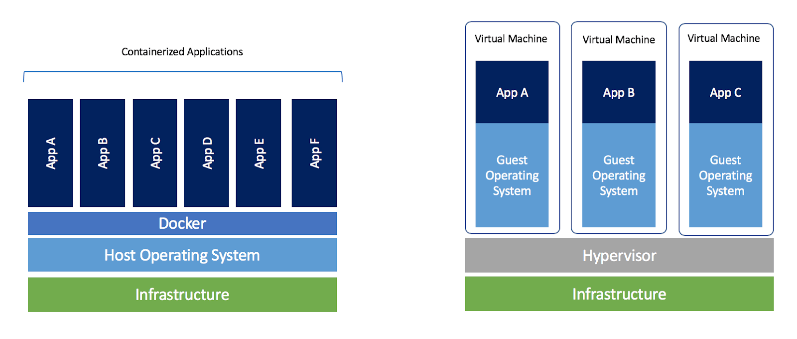
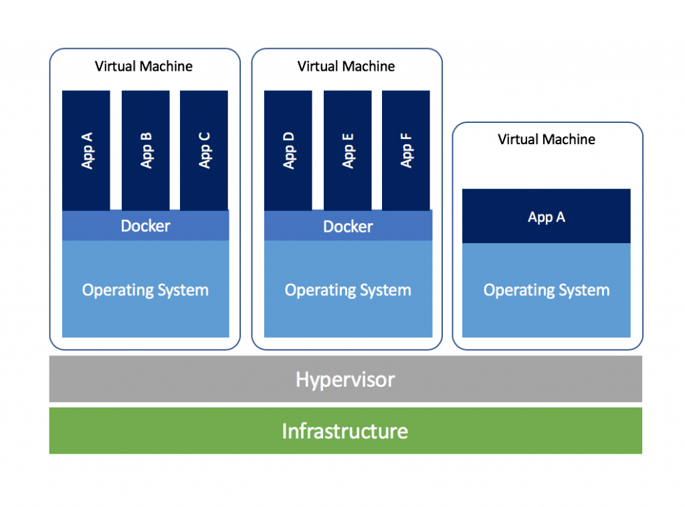

# Overview

## Containers vs. Virtual Machines

| Container                                                    | VM                                                           |
| ------------------------------------------------------------ | ------------------------------------------------------------ |
| Does not contain OS in the container (each container must be based on the same OS) | Contains OS, so each virtual machine can run different OS-based applications |
| Boots up faster                                              | Boost slower                                                 |
| Takes up less space                                          | Takes up more space                                          |

As shown above, we actually want to combine the two like so.

## Container vs. Images

You spawn instances of an image (the instances are the containers).