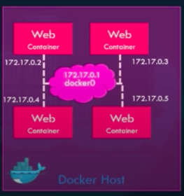

# Docker Networks

## Default Networks

1. Bridge

   - Default network a container gets attached to

   - Private internal network created by Docker on the host

   - Each container in this network gets IP (usually in 172.17 series) and the containers can access each other

     - To access the containers from outside of the docker host, map ports of each container just like before

     

   - `docker run Ubuntu`

2. None

   - `docker run Ubuntu --network=none`

3. Host

   - `docker run Ubuntu --network=host`

