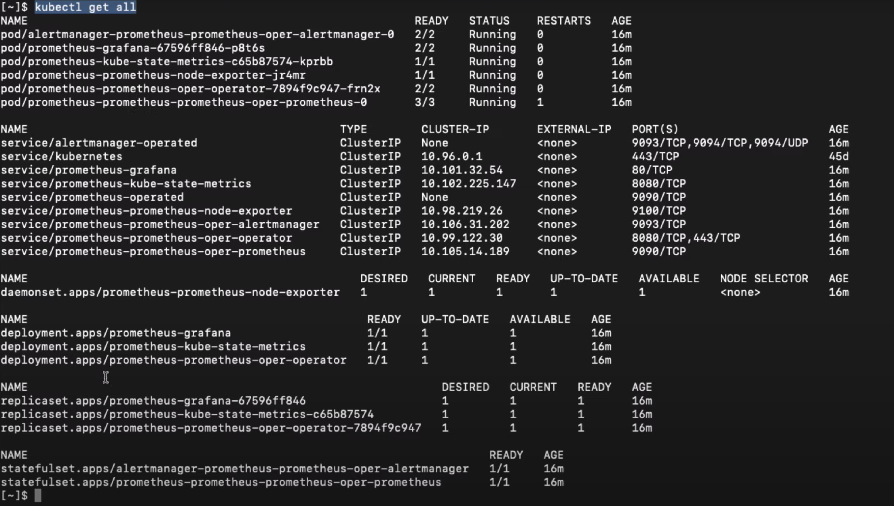

# Kubernetes Architecture

## Example

## Nodes/Minions

A virtual or physical machine where the Kubernetes tools are installed. A node is a working machine where the containers will be launched by Kubernetes.

## Cluster

A set of nodes grouped together. If one node within the cluster fails, there are other nodes in the cluster that can go up to ensure the application is still accessible.

## Master

A node where the control plane in Kubernetes is installed. The master watches over the nodes in the cluster and is responsible for the orchestration of the nodes.

## Components

When installing Kubernetes, here's what you are installing:

1. API server
   - front-end for users
   - interfaces and CLI talk to API server to manage the Kubernetes clusters
2. etcd
   - Stores all data used to manage the clusters
   - e.g. We have a bunch of nodes with a master in the cluster. This ensures there are no conflict between the masters of each cluster.
3. kubelet
   - Agent that runs on each node in the cluster
   - Ensures that the containers are running on the nodes as expected
4. Container Runtime
   - The software that runs the containers (in most cases, Docker)
5. Controller
   - brain behind the orchestration
   - responsible for noticing when nodes go down, and making decisions when to bring up new containers
6. Scheduler
   - responsible for distributing containers across multiple nodes
   - searches for newly created containers and assigns them to nodes 

## DaemonSet

Ensures all worker nodes run a copy of a pod

## Deployment vs. Services

**Deployments** - consists of one or more pods and replicas of pods

**Services** - Manages the list of the pods' IP addresses (in order for pods to be able to access other pods)

https://stackoverflow.com/questions/56896490/what-exactly-kubernetes-services-are-and-how-they-are-different-from-deployments

## ConfigMaps

A ConfigMap is an API object used to store non-confidential data in key-value pairs. [Pods](https://kubernetes.io/docs/concepts/workloads/pods/) can consume ConfigMaps as environment variables, command-line arguments, or as configuration files in a [volume](https://kubernetes.io/docs/concepts/storage/volumes/).

## Stateful Sets

Resources used to maintain stateful applications

- An application that holds the state of the application (if the application goes down, this resource "saves" the data) 
  - e.g. Database

