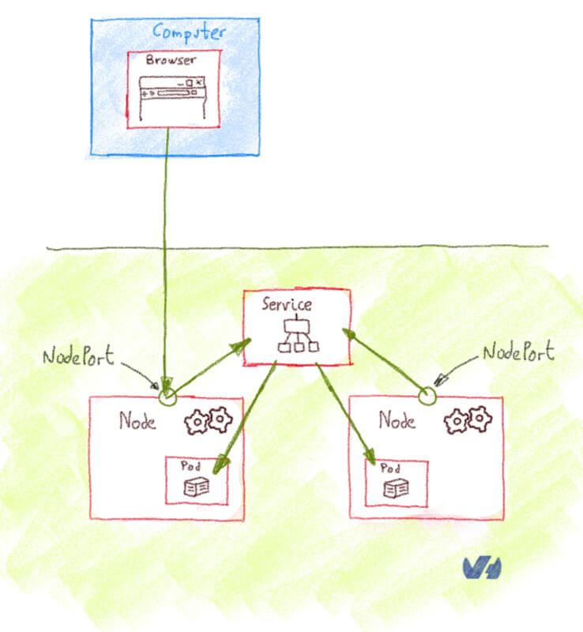

# Kubernetes External Access

https://medium.com/google-cloud/kubernetes-nodeport-vs-loadbalancer-vs-ingress-when-should-i-use-what-922f010849e0

## ClusterIP (Type of Service) & Kubernetes Proxy 

A ClusterIP service is the default Kubernetes service. It gives you a service inside your cluster that other apps inside your cluster can access. There is **no external access with only ClusterIP.**

However, you **can access the ClusterIP service externally using Kubernetes proxy.**

Use when:

1. Debugging your services, or connecting to them directly from your laptop for some reason
2. Allowing internal traffic, displaying internal dashboards, etc.

Requires you to run kubectl as an authenticated user, so **should NOT use this to expose your service to the internet or use it for production services.**

## NodePort (Type of Service)

- Most primitive way to get external traffic to service
- Opens specific port on ALL NODES, then forwards traffic to service



Disadvantages:

1. You can only have one service per port
2. You can only use ports 30000–32767
3. If your Node/VM IP address change, you need to deal with that

Not good for long term production. **Useful for demo apps or temporary apps**

```yaml
apiVersion: v1
kind: Service
metadata:  
  name: my-nodeport-service
spec:
  selector:    
    app: my-app
  type: NodePort
  ports:  
  - name: http
    port: 80
    targetPort: 80
    nodePort: 30036 # This additional port specifies which port to open on all the nodes (you should usually just let Kubernetes do this for you)
    protocol: TCP
```

## Load Balancer (Type of Service)

- standard way to expose a service to the internet
- All traffic on the port you specify will be forwarded to the service (no filtering, routing, etc.)
  - can send almost any kind of traffic to it, like HTTP, TCP, UDP, Websockets, gRPC, etc.


**Disadvantage:** Each service exposed with the load balancer gets its own IP address. Paying for each load balancer for each service gets expensive.

## Ingress (NOT a Type of Service)

- Sits in front of multiple services and act as a “smart router” or entrypoint into your cluster.


Types of Ingress controllers:

- [Google Cloud Load Balancer](https://cloud.google.com/kubernetes-engine/docs/tutorials/http-balancer)
- [Nginx](https://github.com/kubernetes/ingress-nginx)
- [Contour](https://github.com/heptio/contour)
- [Istio](https://istio.io/docs/tasks/traffic-management/ingress.html) 
- Also plugins for Ingress controllers, like the [cert-manager](https://github.com/jetstack/cert-manager), that can automatically provision SSL certificates for your services.

**Useful**:

- Expose multiple services under the same IP address, and these services all use the same L7 protocol (typically HTTP)
- You only pay for one load balancer if you are using the native GCP integration, and because Ingress is “smart” you can get a lot of features out of the box (like SSL, Auth, Routing, etc)