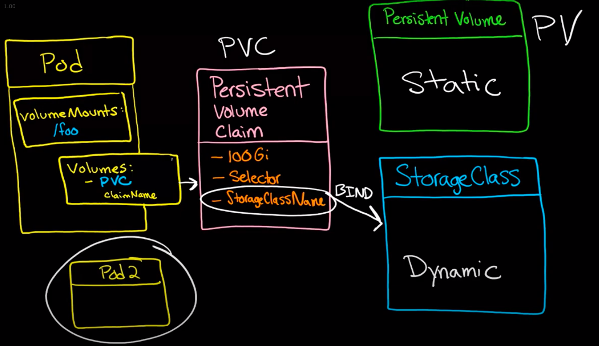
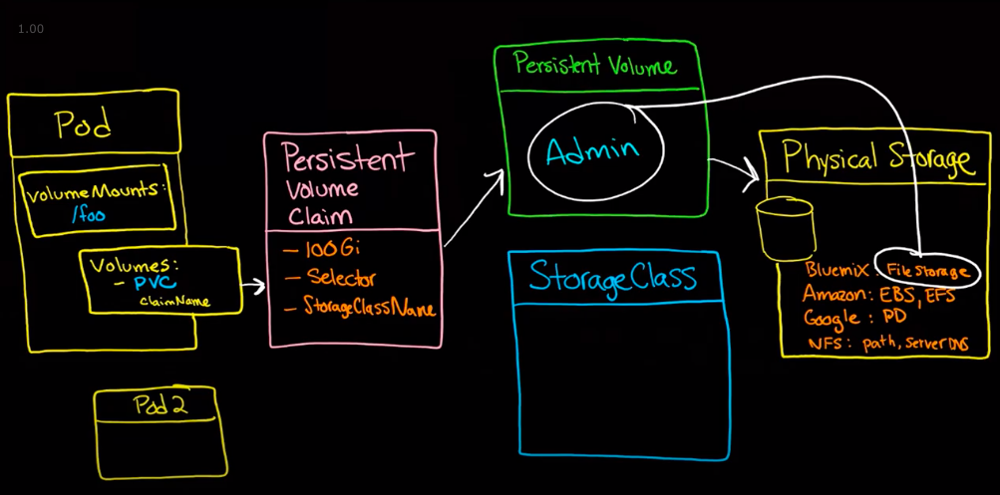

# Volumes

## Persistent Volume (PV) and Persistent Volume Claim (PVC)

**References:**

https://www.youtube.com/watch?v=OulmwTYTauI&ab_channel=SeanWingert

### Persistent Volume Claim (PVC)

- Claims a certain amount of volume for the designated pods
  -  More than one pod can map back to one PVC - so multiple pods can share one storage space if needed
- Does not need to specify where the storage is coming from (Cloud, SSD, etc.), only concerned with how much storage is needed for the pods
  - Since these are supposed to be written up by the developers, the developers don't need to know where the storage is coming from, they just need storage
- PVC **binds** with either a Persistent Volume or a Storage Class

### Persistent Volume (PV)

- Specifies where the volumes are coming from (Cloud, SSD, etc.)
- Acts as an abstraction to physical storage
- Ops people are meant to handle this

**Note:** Cannot bind 2 PVCs to the same PV, but can bind 2 PVs to the same PVC

