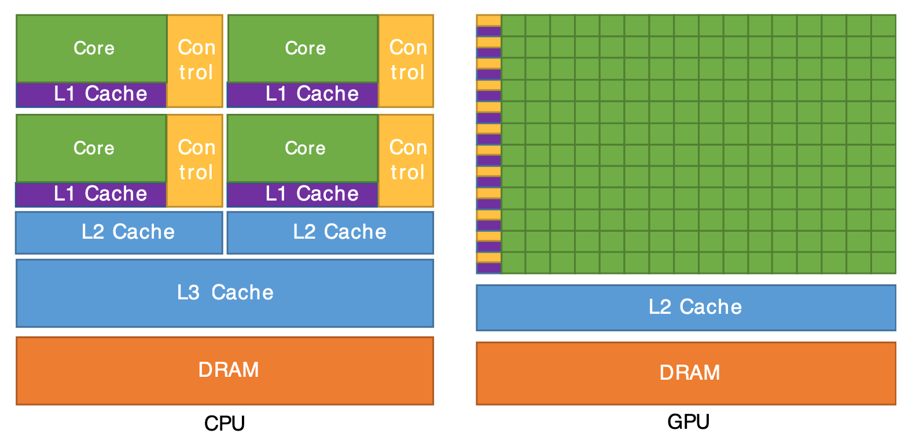

# CPU vs. GPU

| | CPU | GPU |
| --- | --- | --- |
| Cores | Few | Many |
| Clock speed | Higher | Lower |
| Cache | Larger | Smaller (uses VRAM) |
| Memory bandwidth | Lower | Higher (~100 GB/s+) |
| Throughput | Low | High |

Key point: CPU caches are physically larger, so transferring data between them (electrons moving across distance) is slower. GPUs trade per-core speed and cache size for many cores and high memory bandwidth via VRAM — built for throughput.

## Why GPUs are good for deep learning

GPUs have a ton of cores, while CPUs have very few. Deep learning is mostly massively parallel matrix math — every core can crunch a piece of the same operation at once.

The CPU spends most of its die on a few large cores, control logic, and big multi-level caches (L1/L2/L3). The GPU spends almost all of its die on a sea of small cores backed by a shared L2 and high-bandwidth DRAM — perfect for running the same operation across thousands of data points in parallel.
