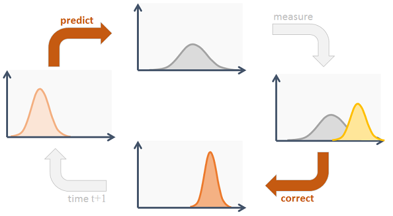
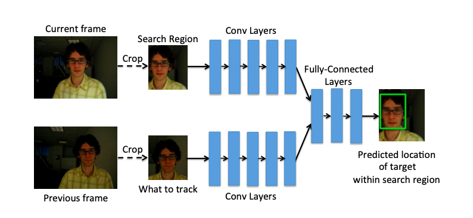

# DeepSort Overview

Refer to [here](https://nanonets.com/blog/object-tracking-deepsort/#introduction).

## Challenges

1. Occlusion
   - Identifying the same object in later frames
2. Different camera angles
   - Identifying the same object at different angles
3. Non-stationary camera
4. Labeling training data
   - Requires video sequences where each instance of the object is identified throughout, for each frame

## Machine Learning Methods for Object Tracking

### [Meanshift/Mode](http://www.chioka.in/meanshift-algorithm-for-the-rest-of-us-python/)

- Algorithm used for **unsupervised** learning
- **Goal**: Find all modes in given data distribution
- Similar to **K-means**, but calculates cluster centres differently:
  - K-means: Uses simple centroid technique
  - Meanshift: Uses a weighted average that gives importance to points that are closer to the mean
    - Also does not require optimum "K" value

**How does it work**?

1. Extract certain features of object in frame 
2. Apply meanshift - we know where the mode of the distribution of features lies in the current state
3. Next frame: The distribution has changed (due to movement), so the algorithm looks for the new largest mode

### [Optical Flow](https://docs.opencv.org/3.4/d4/dee/tutorial_optical_flow.html)

- Uses spatio-temporal image brightness variations at a pixel level (**DOES NOT USE FEATURE EXTRACTION**)
- 4 assumptions
  1. **Brightness consistency**: Brightness around small region is assumed to be nearly constant (location of region could move)
  2. **Spatial coherence**: Neighboring points in a scene usually belong to same surface - so they have similar motions
  3. **Temporal Consistency**: Motion of a region has gradual change
  4. **Limited Motion**: Points don't move too far or very randomly
- After these assumptions are met, **[Lucas-Kanade ](https://sandipanweb.wordpress.com/2018/02/25/implementing-lucas-kanade-optical-flow-algorithm-in-python/)method** used
  - Obtains equation for velocity of certain points to be tracked
  - Use some prediction techniques on top of this

### [Kalman Filters](https://www.codeproject.com/articles/865935/object-tracking-kalman-filter-with-ease)

- **Idea:** Use available detections and previous predictions to arrive at a best guess of current state

#### Scenario

Assume we have a detector with some flaws and we're tracking a moving object. The detector gives us the location of the object. We must leverage this to the best we can. 

**Object motion model:** Predicts the next position of the object - constant velocity motion, acceleration motion

**Measurement noise**: Since the detector is imperfect, there is noise in object locations

**Process noise:** Noise associated with the object motion model.

#### Cycle of a Kalman filter

**Overview:** Propagating and updating Gaussians and their covariances

1. Filter predicts next state (object motion model)
2. If applicable, noisy measurement incorporated for correction
3. Repeat

## Deep Learning Methods for Object Tracking

### [Deep Regression Networks](https://davheld.github.io/GOTURN/GOTURN.html)

Here's the [paper](https://davheld.github.io/GOTURN/GOTURN.pdf). 

**Idea:** Uses two-frame CNN architecture which uses both the current and the previous frame to regress on to the object

1. Take crop from previous frame based on predictions
2. Define "Search region" in current frame based on the crop
3. Now, network is trained to regress for object in search region

**Architecture:** the FC layers directly give the bounding box coordinates

### [Recurrent YOLO (ROLO)](https://arxiv.org/pdf/1607.05781v1.pdf)

- Slight modifications to YOLO with LSTM unit at the end

## Deep SORT

