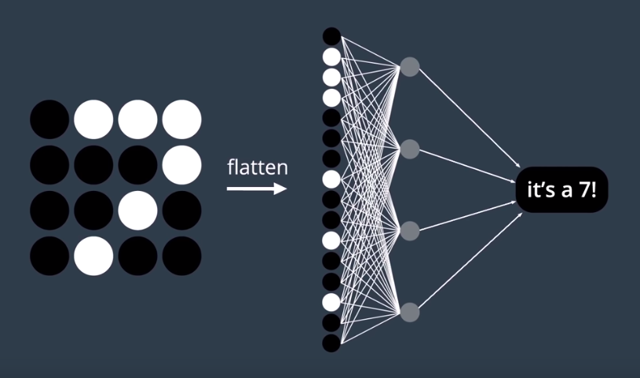
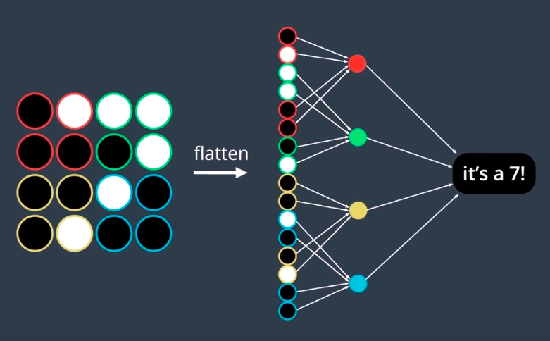
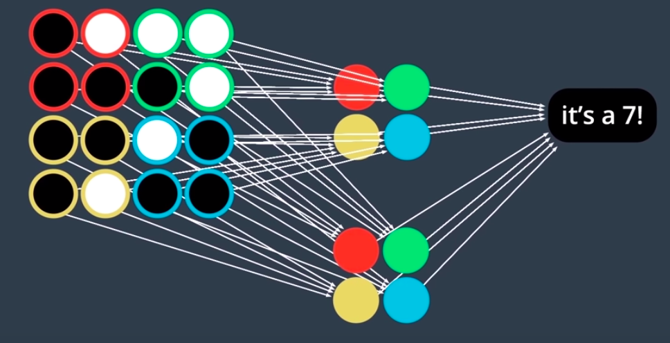

# Convolutional Network Layers

A nice summary: [YouTube](https://www.youtube.com/watch?v=YRhxdVk_sIs)

## Why should we use CNN for image classification over a NN?

1. NNs have **no spatial awareness** - we **lose the 2D space**

- i.e. Remember in PyTorch, we just convert the image to a 1D vector. The model then treats this vector as a simple vector of numbers when in reality, a picture is a 2D grid with different things in different places of the grid. So an NN is not aware of this which is very important when analyzing images since pixels that are closer to one another in a grid can be more related than pixels that are far apart. 

- e.g. The only reason an NN was okay for the MNIST handwriting dataset was because each number in the image of MNIST is in the exact same position, so spatial awareness isn't a factor for classification in this dataset.

2. **Redundancy** in the connections between hidden nodes and input nodes:

   

   Does a hidden node need to be connected to every input node? 

   Not really. We could split it into sections (indicated by the colours) and have it connected like so instead:

   

This way, there are way less connections and thus less calculations to make during training.This way, each node is responsible for finding patterns in their own spatial region as opposed to each node is responsible for finding all patterns in all spatial regions (That's what makes the NN way redundant).

**Note**: This is the meaning of **sparsely** vs. **fully** connected layers. CNNs use sparesely connected layers while NNs use fully connected layers.

We can also easily expand the number of patterns we want to find by introducing more hidden nodes like above.

3. **Images can be large** (e.g. 1000 x 1000)

- If we were to pass in $$10^6$$ neurons per layer, that's a lot of operation
- CNN's extract features of images, then convert the image into lower dimension without losing its characteristics which will decrease the number of parameters the model needs to compute

## High Level Overview on Convolution on One Image

### Stacking Convolutions

- Remember that 1 image can be represented by a matrix/2D tensor
- Each convolution applied on image creates a new matrix/2D tensor
  - These tensors are stacked into 1 3D tensor.
    - e.g. Stacking a convolution that detects horizontal lines on top of a convolution that detects vertical lines, etc.
    - **Result**: The image in 3D.

### Navigating through the Convolutional Tensors

- Moving horizontal across first tensor of 3D tensor:
  - Moving horizontal across image
- Moving vertical down first tensor of 3D tensor:
  - Moving vertical down image
- Moving from first tensor &rarr; second tensor &rarr; third tensor of 3D tensor:
  - Moving from one convolution output to another
  - **Channel** dimension

### Layers (i.e. layers of convolution)

Each set of convolutions applied at the same time is a layer.

1. **Layer 1**: Takes raw pixel intensities and translated into 3D tensor indicating where vertical/horizontal lines
2. **Layer 2**: Takes map from layer 1 as input, multiples by more 3D tensors to find more patterns
3. Continues on

## Layers in CNN

- Detects patterns in images
- With each layer, number of filters must be specified
- Layer receives input, transforms input into outer layer

1. Input layer (A convolutional layer)
2. Convolutional layer (Convo + ReLU)
3. Pooling Layer
4. Fully Connected (FC) Layer
5. Softmax/Logistic Layer
6. Output Layer

## Input Layer

- See Input Layer Notes

## Convolutional Layer

- Feature extractor
- Detects patterns
  - Eg of pattern is (edge, corner, circle, square)
- Geometrical filters are usually the layers at the service of network
- As you go deeper in the network, the filters become more complex and detailed
- Usually has ReLU activation function applied (which means this function is applied on all square of the feature map) to force all negative values to be 0

### Filters/Kernels/Neurons in Convolutional Layers

- Filter (all the same thing) starts in the top left corner of the input image and slides/convolving right across all areas of input image (Covers FxF area at a time)

- Region FxF is the **receptive field**

- Also an array of numbers (aka the **weights**/**parameters**)

- What is happening as it shifts from one area to the next?

  - Multiplying values in filter with original pixel value of image and sum it all up
    - i.e. $$\Sigma(FilterValue*OriginalPixelValue)$$ - You get a single number from this entire area (hence why the dimensions shrink in the feature map)

- **Edge Detection** using filter

  - Convolutions + filters used to detect edges
    - Since darker part &rarr; larger # in that square, horizontal line results in larger numbers, other areas, result in smaller numbers
      - So we know there is an edge if the convolution outputs a large number!
  - **Formula**
    - $$N*N$$ : Image dimensions
    - $$F*F$$ Filter Dimension

  $$Convolution\space Dimension \space Result = N^2*F^2=(N-F+1)^2$$

**Question**:

Which one is true?

- There are more visual patterns that can be captured by large convolutions
- There are fewer visual patterns that can be captured by large convolutions
- The number of visual patterns that can be captured by large convolutions is the same as the number of visual patterns that can be captured by small convolutions?

**Solution**:

There are more visual patterns that can be captured by large convolutions.

- Anything a 2x2 convolution can capture, a 3x3 convolution can also capture, but the things a 3x3 convolution can capture, a 2x2 convolution cannot (it's smaller)

### Stride and Padding in Convolutions (Applies to both Pooling and Convolutional layers)

- Denotes # of steps we are moving in each steps in convolution (default is 1)

- Notice that size of output (feature map) is smaller than the input
- We use **padding** when we want to maintain the input shape's dimensions

- Now you can see the size of the output is the same as the input!

$$Padding= \frac{F-1}{2}$$  &rarr; Padding is dependent on the dimension of filter.

## Max Pooling

A nice summary: [Youtube](https://www.youtube.com/watch?v=ZjM_XQa5s6s)

- **Reduces spatial volume of input imag**e AFTER convolution 
- Used between 2 convolution layers
  - Applying FC after Convo layer is computationally expensive
- In the input matrix, find the maximum value and that is your output feature value
- Why do we do max pooling?
  - Since max pooling reduces resolution of input, so it reduces number of parameters and computational load
  - Helps to reduce overfitting
  - Since convolutional layers look for specific things, the higher number in the layer can be seen as more activated, so with max pooling (it extracts the highest numbers in the layer). We are able to pick out the most activated pixels while discarding not as activated pixel)

- If we have W x H x D, F is filter, S is stride (both hyperparameters)
  - **Dimensions of output after processed by Max Pooling Layer**:
    - $$W'=\frac{W-F}{S+1}$$
    - $$H'=\frac{H-F}{S+1}$$
    - $$D'=D$$
- Example:
  - Set filter size (eg. 2x2)
  - Set stride (eg. 2)
  - Find the maximum number in 2x2 matrix and store it in another grid (which is building to be the output), Keep going in intervals that was set by the stride

## Dense Layers (Fully Connected Layers)

- Involved weights, biases, and neurons
- Connects 1 layer to neurons in another layer (shown in diagram above)

## Softmax/Logistic Layer

- Last layer
- Logistic/Sigmoid - Binary classification
- Softmax - Multiclassification

## Output Layer

- Contains label in form of one-hot encoded