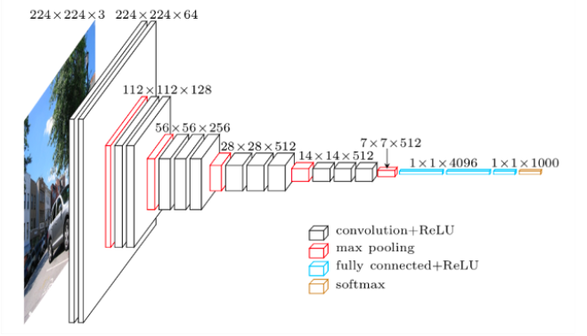
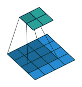
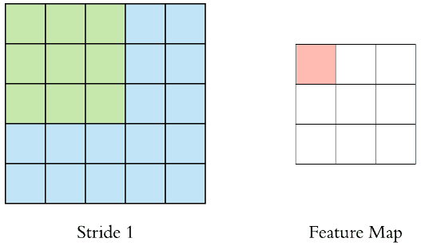
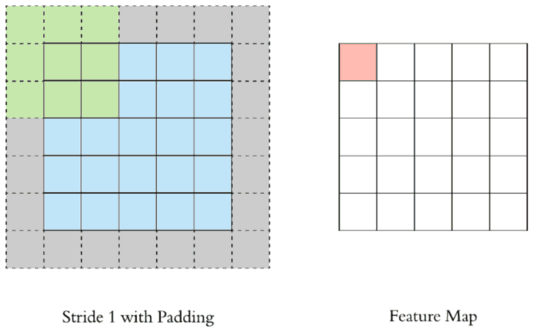

# Convolutional Network Layers

## Why should we use CNN over a NN?

- Images can be large (e.g. 1000 x 1000)
- If we were to pass in $$10^6$$ neurons per layer, that's a lot of operation
- CNN's extract features of images, then convert the image into lower dimension without losing its characteristics

## Prerequisite Knowledge

- **Image Representation**:

  - Encoded into colour channels (RGB, greyscale)

- **Edge Detection**:

  - Convolutions + filters used to detect edges
  - Uses a (#, #) convolution
  - **Formula**
    - $$N*N$$ : Image dimensions
    - $$F*F$$ Filter Dimension

  $$Convolution Result = (N*N)*(F*F)=(N-F+1)*(N-F+1)=(N-F+1)^2$$

- **Stride and Padding**:

  - Denotes # of steps we are moving in each steps in convolution (default is 1)

  

  - Notice that size of output (feature map) is smaller than the input
  - We use **padding** to maintain the input shape's dimensions

  

  - Now you can see the size of the output is the same as the input!

  $$Padding=\frac{F-1}{2}$$  &rarr; Padding is dependent on the dimension of filter.

  

  ## Layers in CNN

  1. Input layer (A convolutional layer)
  2. Convo layer (Convo + ReLU)
  3. Pooling Layer
  4. Fully Connected (FC) Layer
  5. Softmax/Logistic Layer
  6. Output Layer

  

  ### Input Layer

  - See Input Layer Notes

  

  ### Convo Layer

  - Feature extractor

  - Performs convolution

  - **Filter/Kernel/Neuron** (all the same thing) starts in the top left corner of the input image and slides/convolving right across all areas of input image (Covers FxF area at a time) - Refer to `convolution.gif` for an animation

    - Region FxF is the **receptive field**
    - Also an array of numbers (aka the **weights**/**parameters**)
    - What is happening as it shifts from one area to the next?
      - Multiplying values in filter with original pixel value of image and sum it all up
        - i.e. $$\Sigma(FilterValue*OriginalPixelValue)$$ - You get a single number from this entire area (hence why the dimensions shrink in the feature map)

  - Has ReLU activation to make all negative values 0

    

  ### Pooling

  - Reduces spatial volume of input image AFTER convolution 
  - Used between 2 convolution layers
    - Applying FC after Convo layer is computationally expensive

  - If we have W x H x D, F is filter, S is stride (both hyperparameters)
    - $$W'=\frac{W-F}{S+1}$$
    - $$H'=\frac{H-F}{S+1}$$
    - $$D'=D$$

  

  ### Fully Connected Layer (FC) - Dense layers

  - Involved weights, biases, and neurons
  - Connects 1 layer to neurons in another layer

  

  ### Softmax / Logistic Layer

  - Last layer
  - Logistic/Sigmoid - Binary classification
  - Softmax - Multiclassification

  

  ### Output

  - Contains label in form of one-hot encoded