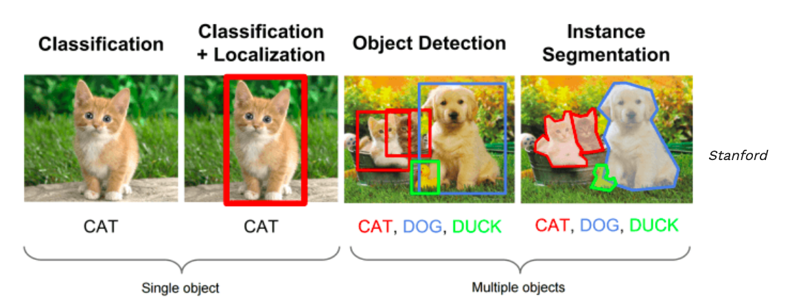
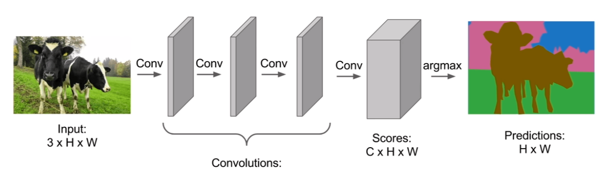
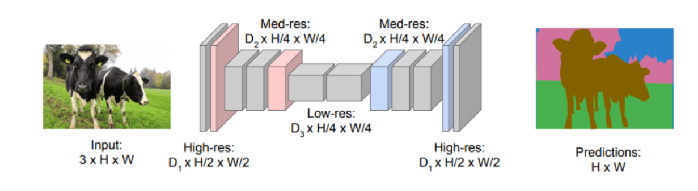

# Localization and Object Detection

## Localization

Find where the object is in the image and draw a bounding box around it.

## Semantic Segmentation

Classify every pixel in the image to a class according to its context, so that each pixel is assigned to an object. Each colour is assigned to a type of object (in this case, red is cat, blue is dog, green is duck).

## How can we achieve both?

Potentialy can use **Fully Convolutional Networks**. They are networks that only consist of convolutional layers without a need to be connected.  

There were 2 problems with them:

- FCNs couldn’t use any downsampling or pooling layers as it will mess up the location of the image instances
- Many layers had to be added to learn both low-level and high-level features to maintain image resolution (computational expensive)

**Solution**: Encoders!

Encoders are typical CNNs such as ResNet that downsample. Decoders would be **deconvolutional **and **up-sampling** layers. This way, we can downsample to capture semantic information and recover the spatial information (both localization and semantic segmentation are achieved!).

### Visual Comparison

However, another problem still persists. When the encoder downsamples, the image resolution is sacrificed. A way to solve this is using something called **Skip Connections**.

## Skip Connections

Bypass layers and transfer the information intact to the next layers. i.e. Passes information from early layers to the encoder (*skips* the encoder).

