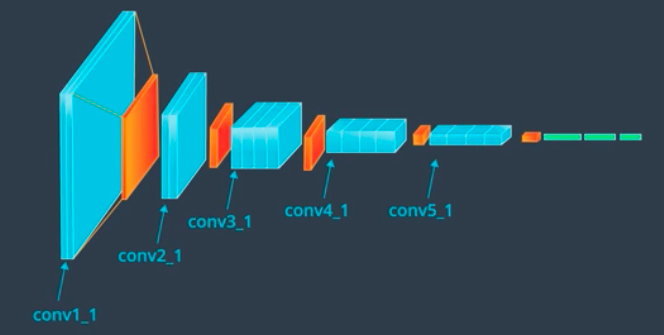
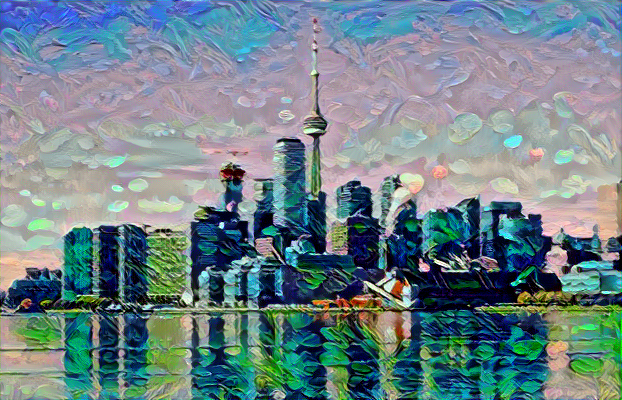

# Style Transfer

Resources: [Image Style Transfer CVPR 2016 paper](https://www.cv-foundation.org/openaccess/content_cvpr_2016/papers/Gatys_Image_Style_Transfer_CVPR_2016_paper.pdf).

## The High-Level Idea: Separating Style and Content

### Content Representation

During pooling, irrelevant information from classification is discarded from the image. Essentially, as we go deeper into the network, the image becomes moreso a representation of content rather than texture and style.

### Style Representation

When extracting feature maps from convolutional layers, we can ask "How do the features in one layer relate to another?". Basically, we want to see the similarities and differences between layers to get an idea of the styles used in the image. At the same time, it should not tell us anything about the identity or placement of the objects in the image (isolating style from content).

### Summary

We will have one **content** image and one **style** image. We will extract the content from the **content** image and extract the style from the **style** image. Then, we will merge these two extractions to create a combined third image.

## Using VGG-19

We will be using this model to output the separate images.

### Content Image

1. We will first feed the content image into VGG-19. It will go through the feed-forward process until it reaches a convolutional layer **(conv_4_2)**, and this will output the content representation of the image.

2. Compare the content representation of the image with the actual content image.

#### Content Loss

Calculates the difference between the content representation of the image, $$C_c$$ and the actual content image, $$T_c$$.

We will be using the mean squared error function: $$L_{content}=\frac{1}{2}\Sigma(T_c-C_c)^2$$. We want to minimize this loss.

**Note**: We are not using the VGG-19 model in a traditional sense where you train the model and it outputs a classification. We are using it as a feature extractor and for backpropagation to minimize the loss function.

### Style Image

We will feed the style image into VGG-19. It will go through multiple convolutional layers and these layers will come together to form the style representation of the image.

The correlations of each layer form a **Gram Matrix**. This is just one mathematical way to find the style representation of an image.

#### Calculating a Gram Matrix

Let's do this with an example.

1. Start with a **4x4** image
2. Fed through a convolutional layer with 8 filters. So now have a **4x4x8** image.
   - There are 8 feature maps we want to find the relationship between
3. Let's take each of those feature maps and vectorize them (flatten into 1D matrix that is **1x16**). In the end, we should have a 2D matrix of **8x16**.
4. Multiply this **8x16** matrix by its transpose.

The final result is the square **8x8** gram matrix. The gram matrix contains non-localized information about the layer (no spatial awareness, even if the image was shuffled around, the gram matrix information would still be present). One gram matrix is produced for one convolutional layer. So with VGG-19, we should have 5 gram matrices.

We can see here that $$G$$, row 4, column 2 shows the similarities between the 4th and 2nd feature maps in a convolutional layer. 

#### Style Loss

The loss will be calculated by taking the difference between the list of gram matrices from the style image, $$S_s$$ and the list of gram matrices from the target image, $$T_s$$.

We will be using this loss function: $$L_{style} = a\Sigma w_i(T_{s,i}-S_{s,i})^2$$, 

- $$a$$ is a constant that accounts for the # of values in each layer
- $$i$$ is the layer #.
- $$w_i$$ are some style weights that will be specified. Each layer will be given a different weight.

The only value that changes here is $$T_{s,i}$$ as we iterate.

### Total Loss

This will be calculated using $$L_{total} = \alpha L_{content}+\beta L_{style}$$.

- $$\alpha$$ is a constant that represents the content weight
- $$\beta$$ is a constant that represents the style weight, and is often much larger than $$\alpha$$.

These constants can be written as a ratio: $$\frac{\alpha}{\beta}$$. If you want more "content" in the image than "style", then this ratio would be larger. If you want more "style" in the image than "content", then this ratio would be smaller.

**Note**: These weights must be multiplied to each loss because both loss functions are calculated pretty differently, but in the end, we want both loss functions to be equally weighted. So we need these weights to balance things out.

## Results

Here are some successful results from the notebook!

