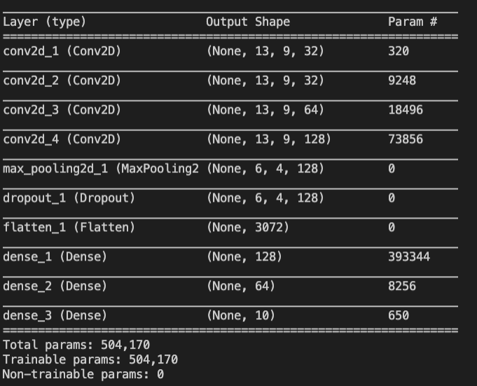
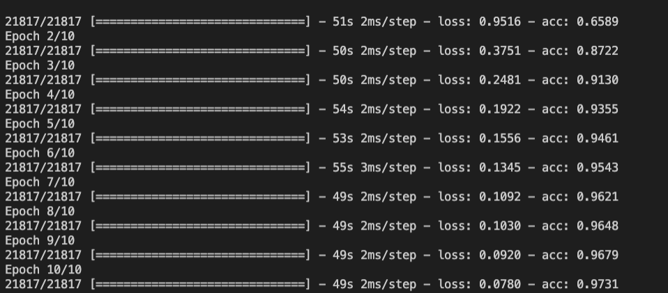

# Building the CNN

Continuing from last time, we have the input array, X, and their respective labels in the array, y.

 **X**: (num_sample, 13, 9, 1) - 

**y**; (num_sample, 10) - 10 is the number of classes we have to classify

## Preparing input shape

- We don't care much for X.shape[0] since this is just the number of samples, hence why we take index 1 and 2 and add 1 to the end since we are training a CNN.

```python
input_shape = (X.shape[1], X.shape[2], 1)
```

## Flatten y

- Flatten means to transform the ndarray into a 1D list (no columns)

-  `np.argmax(ndarray, axis=0/1)`
  - Go row by row in y and return the index where 1 is (since the rest are 0, 1 is the max from hot encoding)

```python
# Dimensions: (21817, )
y_flat = np.argmax(y, axis=1)
```

## Get Class Weight

- Shifts gradient descent so that classes with less data (e.g. bass drum) will not be overlooked
- Reduces bias
- `compute_class_weight("balanced", List of the categories' indexes, flattened array of the labels after hot encoding)`
- Used in `model.fit()`

```python
from sklearn.utils.class_weight import compute_class_weight
class_weight = compute_class_weight(
    "balanced",
    np.unique(y_flat), 
    y_flat
)
```

## Create CNN

1. Sequential Model

   - Used to easily "add" consecutive layers in Keras
   - In more complicated models, we would have to tell model which layers are connected to which

2. Add 4 Convolutional Layers

   - Start with 16 layers and go up by powers of 2 (filters are tupically in powers of 2)
     - Progressively increase layers in hopes of learning more (and the more layers you pass the input through, the more specific details your model can learn)
   - Strides are `(1,1)` since our input matrix size is only `(13, 9, 1)` which is quite small
     - Bigger input matrixes would be better with `(2, 2)` or even `(5, 5)`
   - `padding="same"` conserves the dimensions of the input's shape in the previous layer

3. Max pooling

   - Since out input matrix size is quite small, there is no need to pool down extensively

4. Dropout Layer

   - May consider putting this more frequently between layers

   - BARE MINIMUM: Build it before the flatten layer

   - Dropout Layer

   - May consider putting this more frequently between layers
   - BARE MINIMUM: Build it before the flatten layer

5. Flatten Layer

   - Flattens the data to 1 dimension

6. Dense Layers

   - Add 3 dense layers that decrease until you reach the number of classes that are available to classify (10)
   - Activation function is softmax for output layer

```python
# Sequential Model
model = Sequential()

# Convolutional Layers
model.add(Conv2D(32, (3, 3), activation="relu", strides=(1, 1), padding="same", input_shape=input_shape))
model.add(Conv2D(32, (3, 3), activation="relu", strides=(1, 1), padding="same"))
model.add(Conv2D(64, (3, 3), activation="relu", strides=(1, 1), padding="same"))
model.add(Conv2D(128, (3, 3), activation="relu", strides=(1, 1), padding="same"))

# Max Pooling
model.add(MaxPool2D((2, 2)))

# Dropout Layer
model.add(Dropout(0.5))

# Flatten Layer
model.add(Flatten())

# Dense Layers
model.add(Dense(128, activation="relu"))
model.add(Dense(64, activation="relu"))
model.add(Dense(10, activation="softmax"))

# 
model.compile(loss="categorical_crossentropy", optimizer="Adam", metrics=["acc"])

# Model Summary
model.summary()

# Training CNN
model.fit(X, y, epochs=10, batch_size=32, shuffle=True, class_weight=class_weight)
```

- Model evaluation
  - `categorical_crossentropy` is good for multiclass classification
  - Adam is go-to optimizer (allows you to not specify momentum)
- Model summary
  - Note large numbers and see if you can reduce them (especially param # as they could be taking up unnecessary processing power when your model is being fitted)



## Training Results




