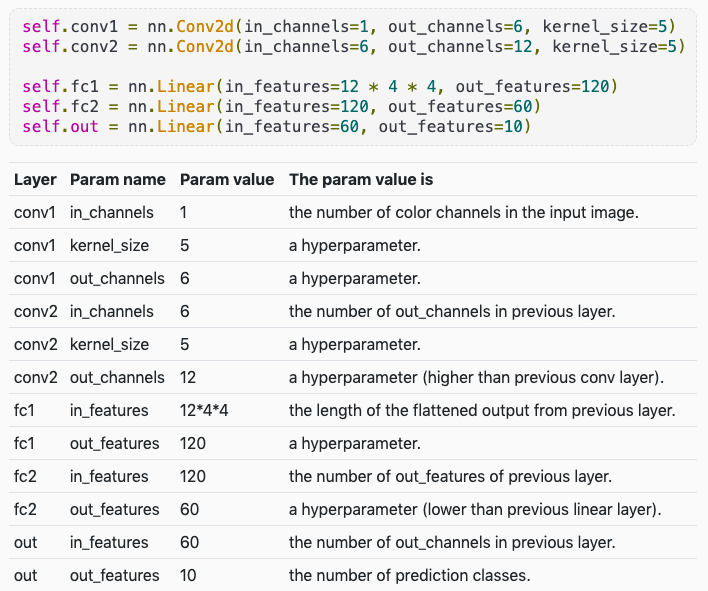

#  Convolutional Neural Networks Walkthrough

Great video by deeplizard! [Youtube](https://www.youtube.com/watch?v=IKOHHItzukk).

Here's an example of how shape dimensions change throughout a convolutional neural network.

```python
import torch.nn.functional as F

# Formula to calculate convolutional layer output spatial dimensions
conv_spatial_dimensions = int((in_size - kernel_size + 2*(padding)) / stride + 1

class SimpleCNN(torch.nn.Module):
    # Our batch shape for input x is (3, 32, 32)
    # 3 comes from the fact the image is RGB, grayscale would be 1
    
    def __init__(self):
        super(SimpleCNN, self).__init__()
        
        # Input channels = 3 (since the image has depth=3 because RGB), output channels = 18
        self.conv1 = torch.nn.Conv2d(3, 18, kernel_size=3, stride=1, padding=1)
        self.pool = torch.nn.MaxPool2d(kernel_size=2, stride=2, padding=0)
        
        #4608 input features, 64 output features (see sizing flow below)
        self.fc1 = torch.nn.Linear(18 * 16 * 16, 64)
        
        #64 input features, 10 output features for our 10 defined classes
        self.fc2 = torch.nn.Linear(64, 10)
        
    def forward(self, x):
        # Computes the activation of the first convolution
        # Size changes from (3, 32, 32) to (18, 32, 32)
        x = F.relu(self.conv1(x))
        
        # Size changes from (18, 32, 32) to (18, 16, 16)
        x = self.pool(x)
        
        # Reshape data to input to the input layer of the neural net
        # Size changes from (18, 16, 16) to (1, 4608)
        # Recall that the -1 infers this dimension from the other given dimension
        x = x.view(-1, 18 * 16 * 16)
        
        # Computes the activation of the first fully connected layer
        # Size changes from (1, 4608) to (1, 64)
        x = F.relu(self.fc1(x))
        
        # Computes the second fully connected layer (activation applied later)
        # Size changes from (1, 64) to (1, 10)
        x = self.fc2(x)
        return(x)
```



**Typical Kernel Sizes**: 2x2 - 7x7 (usually square)

**Maxpooling Example**: `nn.MaxPool2d(kernel_size, stride)`. If both are 2, then the dimensions of the image would decrease by x2.