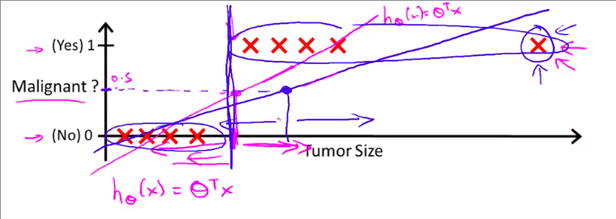

# Classification and Representation

## Classification Problem

This problem is just like the linear regression problem except that the predicted values can only take on a small number of discrete values (e.g. 0 or 1).

### Why can't we use linear regression to solve Classification Problem?

As you can see here, if we have a datapoint that is kind of an outlier, the line of best fit gets skewed to the point the threshold becomes inaccurate to the dataset.