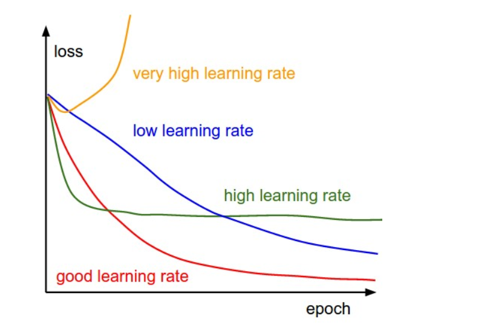

# Multivariate Linear Regression

This is linear regression, but with multiple variables. So we have a new hypothesis function!

## Hypothesis: $$h_\theta(x)=\theta_0+\theta_1x_1+...+\theta_{n-1}x_{n-1}+\theta_nx_n=\theta^Tx$$ 

## Parameters: $$\theta_0, \theta_1, ... ,\theta_n=\theta\in\R^{n+1}$$

## Variables: $$x_0, x_1,...,x_n=x\in\R^{n+1}$$

e.g. Think of each variable as a different feature. $$x_1$$ could be square footage, $$x_2$$ could be number of floors, etc.

## Gradient Descent for Multiple Variables

Repeat until convergence {

​	$$\theta_0:=\theta_0-\alpha\frac{1}{m}\Sigma\space ((h_\theta(x^{(i)})-y^{(i)})x_0^{(i)})$$

​	$$\theta_1:=\theta_1-\alpha\frac{1}{m}\Sigma\space ((h_\theta(x^{(i)})-y^{(i)})x_1^{(i)})$$

​	$$\theta_2:=\theta_2-\alpha\frac{1}{m}\Sigma\space ((h_\theta(x^{(i)})-y^{(i)})x_2^{(i)})$$

​	...

}

We can condense this down to:

### Gradient Descent Algorithm for Multiple Variables:

Repeat until convergence {

​	$$\theta_j:=\theta_j-\alpha\frac{1}{m}\Sigma\space ((h_\theta(x^{(i)})-y^{(i)})x_j^{(i)})$$ for $$j=0,1,2,..,n$$

}

## Gradient Descent with Feature Scaling

Feature scaling **speeds up** gradient descent and ensures gradient descent to **converge**.

Let $$x_i$$ be a feature like age of house. 

We generally want the range of the feature to stay in either one of these intervals:

 $$-1\le x_i\le1, -0.5\le x_i\le 0.5$$

### Mean Normalization: $$x_i := \frac{x_i-\mu_i}{s_i}$$

This is a way you can ensure feature scaling ($$s_i$$ is range).

## Choosing a Learning Rate for Gradient Descent

### Debugging Gradient Descent

Plot # of iterations of gradient descent on x-axis and $$J(\theta)$$ on y-axis.

**Automatic convergence test**: If $$J(\theta)$$ is decreasing by less than $$10^{-3}$$, most likely has converged (but usually just use a graph because it's easier to see).

**Summary**:

If $$\alpha$$ is too large &rarr; loss function will diverge (yellow line)

If $$\alpha$$ is too small &rarr; loss function will converge too slowly (green line).

If $$\alpha$$ is good &rarr; loss function will decrease every epoch at a reasonable time. 

## Creating Features for Polynomial Regression

We don't always have to stick to only having the features in the equation. We can derive more from existing features.

**Examples**:

Let our hypothesis be $$h_\theta(x)=\theta_0+\theta_1x_1.$$

What if we don't want a linear function to fit the data? What if we want a parabola, square root, cubic?

To get a square root function from this:  $$h_\theta(x)=\theta_0+\theta_1x_1+\theta_2\sqrt{x_1}$$

Let $$\sqrt{x_1}=x_2$$. We have created a new feature $$x_2$$! So now we have: $$h_\theta(x)=\theta_0+\theta_1x_1+\theta_2x_2$$.

**Note**: Feature scaling is very important here! Imagine if you created a cubic function. Your new feature would then be $$x_1^3$$, so the values would be very large. 

