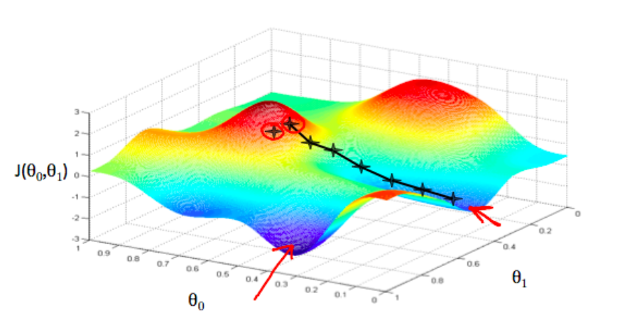
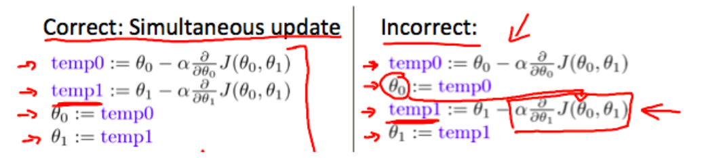

# Parameter Learning

## Gradient Descent

So now we have a way to measure how well $$h$$ fits the training data (remember we just have to minimize the cost function). Okay, but how do we estimate those parameters?

Visually here, $$J(\theta_0, \theta_1)$$ is graphed with its parameters. If we started where the red circles are. Imagine we are trying to look for the lowest point to walk to. Once we choose that point, we would walk to it, and now our position would be at that lower point. This process continues until you reach the lowest point. However, notice that if you start at another location, you could possibly end up at another lowest point.

### Gradient Descent Algorithm: $$\theta_j:=\theta_j-\alpha\frac{\partial}{\partial\theta_j}J(\theta_0,\theta_1)$$

Let's explain what this means. 

- $$:=$$ is just an **assignment operator**. In math, it's just not right to say $$a=a+1$$, but in CS it is. So using this operator makes it all good.
- $$\alpha$$ is the **learning rate**. 
  - Visual representation: The distance between the X's in the graph is the magnitude of the learning rate.
    - If $$\alpha$$ is large &rarr; The steps are greater.
    - If $$\alpha$$ is small &rarr; The steps are smaller.
- $$\frac{\partial}{\partial\theta_j}J(\theta_0,\theta_1)$$ is the **partial derivative of the cost function**. It represents the direction of the step taken.

This algorithm keeps reassigning itself until it has reached convergence.

#### Updating simultaneously

At each iteration of this algorithm, the parameters of the loss function (so $$\theta_0$$ and $$\theta_1$$ in this case), are updated **simultaneously**. If you do not do this, the first parameter's update value will affect the next one, and we don't want that.

