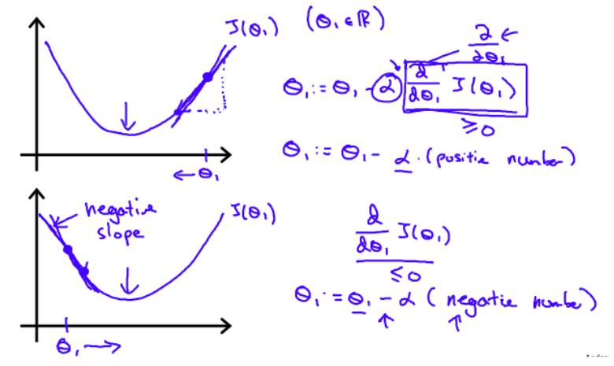
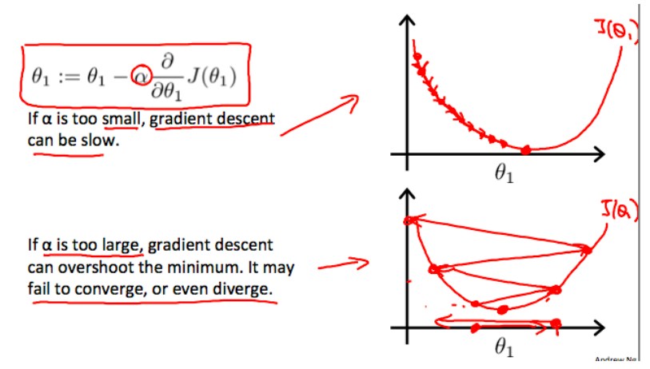
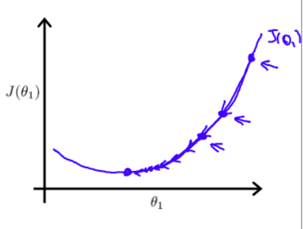

# Parameter Learning 

## Visual Representation of Gradient Descent

So now we have a way to measure how well $$h$$ fits the training data (remember we just have to minimize the cost function). Okay, but how do we estimate those parameters?

Visually here, $$J(\theta_0, \theta_1)$$ is graphed with its parameters. If we started where the red circles are. Imagine we are trying to look for the lowest point to walk to. Once we choose that point, we would walk to it, and now our position would be at that lower point. This process continues until you reach the lowest point. However, notice that if you start at another location, you could possibly end up at another lowest point.

## Gradient Descent Algorithm: 

Repeat until convergence {

​	$$\theta_j:=\theta_j-\alpha\frac{\partial}{\partial\theta_j}J(\theta_0,\theta_1)$$

}

Let's explain what this means. 

- $$:=$$ is just an **assignment operator**. In math, it's just not right to say $$a=a+1$$, but in CS it is. So using this operator makes it all good.
- $$\alpha$$ is the **learning rate**. 
  - Visual representation: The distance between the X's in the graph is the magnitude of the learning rate.
    - If $$\alpha$$ is large &rarr; The steps are greater.
    - If $$\alpha$$ is small &rarr; The steps are smaller.
- $$\frac{\partial}{\partial\theta_j}J(\theta_0,\theta_1)$$ is the **partial derivative of the cost function**. It represents the direction of the step taken.

This algorithm keeps reassigning itself until it has reached convergence.

#### Updating simultaneously

At each iteration of this algorithm, the parameters of the loss function (so $$\theta_0$$ and $$\theta_1$$ in this case), are updated **simultaneously**. If you do not do this, the first parameter's update value will affect the next one, and we don't want that.

## How does the partial derivative of $$J(\theta_1)$$ affect gradient descent?

**Summary**: The point is, wherever we start on the curve, gradient descent ensures that our hypothesis becomes more and more accurate as it tries to minimize the cost function curve.

If $$\frac{\partial}{\partial\theta_1}J(\theta_1)>0\implies\theta_1$$ decreases

If $$\frac{\partial}{\partial\theta_1}J(\theta_1)<0\implies\theta_1$$ increases

## How does the learning rate, $$\alpha$$ affect gradient descent?

## How does gradient descent converge with a fixed learning rate?

The slope of the highest point on the graph has the steepest slope (and thus highest derivative), and the slopes keep decreasing as we go down the graph. Looking at the equation again: $$\theta_j:=\theta_j-\alpha\frac{\partial}{\partial\theta_j}J(\theta_0,\theta_1)$$, we can see that as our derivative/slope decreases, the gradient descent changes less and less - explaining the smaller steps taken in the graph. **Conclusion**: We actually don't need to decrease $$\alpha$$ over time. 

## Gradient Descent Algorithm for Linear Regression:

- Aka **Batch Gradient Descent** because we are using **m** training samples which represents ALL training samples

Repeat until convergence {

​	$$\theta_0:=\theta_0-\alpha\frac{1}{m}\Sigma\space (h_\theta(x_i)-y_i)$$

​	$$\theta_1:=\theta_1-\alpha\frac{1}{m}\Sigma\space ((h_\theta(x_i)-y_i)x_i)$$

}, $$m$$ is the # of training samples

#### Derivation:

Steps that we took to get the above equation:

1. Start with the gradient descent algorithm $$\theta_j:=\theta_j-\alpha\frac{\partial}{\partial\theta_j}J(\theta_0,\theta_1)$$
2. Sub the cost function with the mean squared error function since we are finding the gradient descent algorithm for linear regression.

$$\theta_j:=\theta_j-\alpha\frac{\partial}{\partial\theta_j}\frac{1}{2m}\Sigma(h_\theta(x_i)-y_i)^2$$ 

3. Write the hypothesis function in terms of parameters $$\theta$$.

$$\theta_j:=\theta_j-\alpha\frac{\partial}{\partial\theta_j}\frac{1}{2m}\Sigma(\theta_0+\theta_1x_i-y_i)^2$$ 

3. Now we should find the single variable derivatives of the parameters like so:

$$\theta_0=\theta_0-\alpha\frac{1}{m}\Sigma(\theta_0+\theta_1x_i-y_i)$$ 

$$\theta_1:=\theta_1-\alpha\frac{1}{m}\Sigma(\theta_0+\theta_1x_i-y_i)x_i$$ 

4. Sub the hypothesis equation back and you get the gradient descent algorithm for linear regression!

**Note**: In these examples, we are using linear regression. Remember the cost function for linear regression problem is a bowl shape (if it is multvariable/has multiple parameters), so it has ONE minimum. So, **gradient descent always converges for linear regression** assuming the learning rate is not too large (otherwise, the gradient descent would overshoot and diverge).