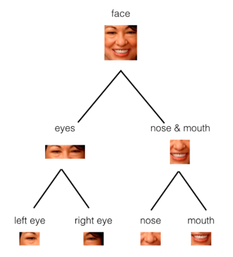

# Capsule Networks

An alternative to pooling in convolutional neural networks.

## Problems with Pooling

Sometimes when outputting a smaller representation of an image, spatial information is lost. We can use capsule networks to avoid this.

## What are Capsule Networks?

They detect parts in an object within the context of the spatial information. 

Capsule networks are made of parent and child nodes that build up a complete picture of an object.

## What are Capsules?

Capsules are a collection of nodes. Each node contains information about a specific part (width, orientation, colour), and outputs a vector with:

- Magnitude ($$m$$) = the probability that a part exists; a value between 0 and 1.
- Orientation ($$\theta$$) = the state of the part properties 

## Pytorch Implementation 

Here's a [Github](https://github.com/cezannec/capsule_net_pytorch/blob/master/Capsule_Network.ipynb) repo of a PyTorch implementation.