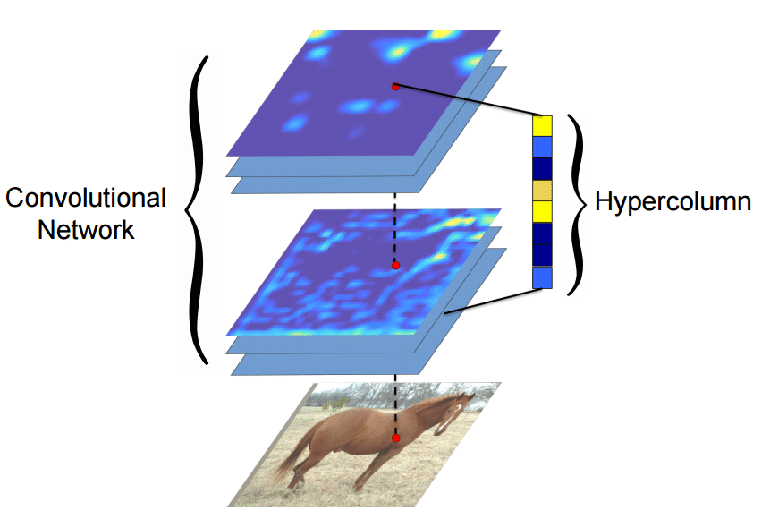

# Convolutional Hypercolumns

Refer to this [link](http://blog.christianperone.com/2016/01/convolutional-hypercolumns-in-python/)

## What is it?

**Hypercolumn** of a pixel is the vector of activations of all CNN units “above” that pixel. They contain missing information from the first and last layers. 

Hypercolumns are something you extract from the network, not build.

## When are they used?

The last fully connected layer in a CNN may be too coarse too allow for **localization** precision. The first layers could be spatially precise but lacks **semantic information**. **Hypercolumns** help with improving both since it contains information on the first and last layers.

## Extracting Hypercolumns (VGG-16)

[Setting up VGG-16 Model with Keras](https://gist.github.com/baraldilorenzo/07d7802847aaad0a35d3)

