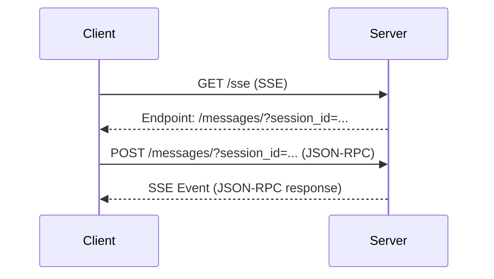

# Summary: Integrating Cursor with a Local MCP Server for SSE Communication

This guide covers the steps and solutions discussed for integrating a local **MCP server** with **Cursor**, and fixing some common issues with the SSE (`/sse`) and message handling (`/messages`).

---

## Overview of SSE and MCP Communication

### 1. **MCP Server and SSE**:
Server-Sent Events (SSE) is a protocol where the server pushes updates to the client over a single, long-lived HTTP connection. The MCP server uses SSE for real-time communication with clients like Cursor.

### 2. **Endpoints in MCP Communication**:
The MCP server communicates with the client using two key endpoints:

- **`/sse`**: The client initially connects to this endpoint to establish the SSE connection. This is where the server sends events like `endpoint` or other messages during the session.
- **`/messages`**: Once the client receives the `endpoint` event, it sends subsequent messages (like JSON-RPC) to this endpoint.

---

### **Step-by-Step Communication Flow**:

1. **Client Connects to `/sse`**:
   - The client (Cursor) sends an HTTP request to the server’s `/sse` endpoint to start the SSE stream.
   - **Request Example**:
     ```
     GET https://yourserver.com/sse
     ```

2. **Server Sends the `endpoint` Event**:
   - Upon establishing the SSE connection, the server responds by sending an `endpoint` event.
   - This event tells the client where future messages should be sent (usually to `/messages`).
   - **SSE Response Example**:
     ```
     event: endpoint
     data: {"url": "/messages/"}
     ```

3. **Client Sends Messages to `/messages`**:
   - Once the client has received the `endpoint` event, it begins sending messages to the `/messages` endpoint, which could include any JSON-RPC or other communication the client needs to process.
   - **Example of a POST Request to `/messages`**:
     ```
     POST https://yourserver.com/messages
     {
       "jsonrpc": "2.0",
       "method": "some_method",
       "params": {},
       "id": 1
     }
     ```

4. **Server Responds via SSE**:
   - After processing the message, the server sends a response or another event (like `message`) to the client via the SSE connection. This might contain data or a result from
  
### **Step-by-Step Communication Flow -- but even more detail**:

This is the debug log from my MCP server:

```bash
341579492cf144d28c8f57bf9b38b2b3 HTTP/1.1" 202 Accepted
2025-06-09 23:51:57,486 - mcp.server.lowlevel.server - DEBUG - Received message: <mcp.shared.session.RequestResponder object at 0x11aebe510>
2025-06-09 23:51:57,486 - mcp.server.lowlevel.server - INFO - Processing request of type ListToolsRequest
2025-06-09 23:51:57,486 - mcp.server.lowlevel.server - DEBUG - Dispatching request of type ListToolsRequest
2025-06-09 23:51:57,486 - mcp.server.lowlevel.server - DEBUG - Response sent
2025-06-09 23:51:57,486 - mcp.server.sse - DEBUG - Sending message via SSE: SessionMessage(message=JSONRPCMessage(root=JSONRPCResponse(jsonrpc='2.0', id=2, result={'tools': [{'name': 'is_user_in_dl', 'description': 'Check if user is in a given DL', 'inputSchema': {'properties': {'user_identity': {'title': 'User Identity', 'type': 'string'}, 'dl_name': {'title': 'Dl Name', 'type': 'string'}}, 'required': ['user_identity', 'dl_name'], 'type': 'object'}}, {'name': 'get_user', 'description': 'Get user from Helios', 'inputSchema': {'properties': {'user_identity': {'title': 'User Identity', 'type': 'string'}}, 'required': ['user_identity'], 'type': 'object'}}]})), metadata=None)
2025-06-09 23:51:57,486 - sse_starlette.sse - DEBUG - chunk: b'event: message\r\ndata: {"jsonrpc":"2.0","id":2,"result":{"tools":[{"name":"is_user_in_dl","description":"Check if user is in a given DL","inputSchema":{"properties":{"user_identity":{"title":"User Identity","type":"string"},"dl_name":{"title":"Dl Name","type":"string"}},"required":["user_identity","dl_name"],"type":"object"}},{"name":"get_user","description":"Get user from Helios","inputSchema":{"properties":{"user_identity":{"title":"User Identity","type":"string"}},"required":["user_identity"],"type":"object"}}]}}\r\n\r\n'
2025-06-09 23:52:01,311 - sse_starlette.sse - DEBUG - ping: b': ping - 2025-06-10 06:52:01.311221+00:00\r\n\r\n'
2025-06-09 23:52:01,694 - mcp.server.sse - DEBUG - Handling POST message
2025-06-09 23:52:01,694 - mcp.server.sse - DEBUG - Parsed session ID: 34157949-2cf1-44d2-8c8f-57bf9b38b2b3
2025-06-09 23:52:01,694 - mcp.server.sse - DEBUG - Received JSON: b'{"method":"tools/list","jsonrpc":"2.0","id":3}'
2025-06-09 23:52:01,695 - mcp.server.sse - DEBUG - Validated client message: root=JSONRPCRequest(method='tools/list', params=None, jsonrpc='2.0', id=3)
2025-06-09 23:52:01,695 - mcp.server.sse - DEBUG - Sending session message to writer: SessionMessage(message=JSONRPCMessage(root=JSONRPCRequest(method='tools/list', params=None, jsonrpc='2.0', id=3)), metadata=ServerMessageMetadata(related_request_id=None, request_context=<starlette.requests.Request object at 0x11aee99a0>))
INFO:     127.0.0.1:52935 - "POST /messages/?session_id=341579492cf144d28c8f57bf9b38b2b3 HTTP/1.1" 202 Accepted
2025-06-09 23:52:01,695 - mcp.server.lowlevel.server - DEBUG - Received message: <mcp.shared.session.RequestResponder object at 0x11aebfc20>
2025-06-09 23:52:01,695 - mcp.server.lowlevel.server - INFO - Processing request of type ListToolsRequest
2025-06-09 23:52:01,696 - mcp.server.lowlevel.server - DEBUG - Dispatching request of type ListToolsRequest
2025-06-09 23:52:01,696 - mcp.server.lowlevel.server - DEBUG - Response sent
2025-06-09 23:52:01,696 - mcp.server.sse - DEBUG - Sending message via SSE: SessionMessage(message=JSONRPCMessage(root=JSONRPCResponse(jsonrpc='2.0', id=3, result={'tools': [{'name': 'is_user_in_dl', 'description': 'Check if user is in a given DL', 'inputSchema': {'properties': {'user_identity': {'title': 'User Identity', 'type': 'string'}, 'dl_name': {'title': 'Dl Name', 'type': 'string'}}, 'required': ['user_identity', 'dl_name'], 'type': 'object'}}, {'name': 'get_user', 'description': 'Get user from Helios', 'inputSchema': {'properties': {'user_identity': {'title': 'User Identity', 'type': 'string'}}, 'required': ['user_identity'], 'type': 'object'}}]})), metadata=None)
2025-06-09 23:52:01,696 - sse_starlette.sse - DEBUG - chunk: b'event: message\r\ndata: {"jsonrpc":"2.0","id":3,"result":{"tools":[{"name":"is_user_in_dl","description":"Check if user is in a given DL","inputSchema":{"properties":{"user_identity":{"title":"User Identity","type":"string"},"dl_name":{"title":"Dl Name","type":"string"}},"required":["user_identity","dl_name"],"type":"object"}},{"name":"get_user","description":"Get user from Helios","inputSchema":{"properties":{"user_identity":{"title":"User Identity","type":"string"}},"required":["user_identity"],"type":"object"}}]}}\r\n\r\n'
```

Here's a step-by-step breakdown of the MCP interaction shown in the logs:

### 1. **SSE Connection Establishment**
- **Client** sends `GET /sse` to initiate SSE streaming  
- **Server**:
  - Creates new session (`957ca12d-...`)  
  - Returns `200 OK` with `text/event-stream`  
  - Sends initial `endpoint` event with POST URL:  
    ```text
    event: endpoint
    data: /messages/?session_id=957ca12d...
    ```
  - This tells the client where to send future requests[1]

### 2. **Client Initialization**
- **Client** POSTs to `/messages/?session_id=...`:
  ```json
  {
    "method": "initialize",
    "params": {
      "protocolVersion": "2025-03-26",
      "capabilities": {/*...*/},
      "clientInfo": {"name": "cursor-vscode"}
    },
    "id": 1
  }
  ```
- **Server** responds via SSE:
  ```text
  event: message
  data: {"jsonrpc":"2.0","id":1,"result":{
    "protocolVersion":"2025-03-26",
    "serverInfo":{"name":"CASP MCP","version":"1.9.2"}
  }}
  ```
  This negotiates protocol capabilities[1]

### 3. **Notification Handling**
- **Client** sends notification (no response needed):
  ```json
  {"method":"notifications/initialized","jsonrpc":"2.0"}
  ```
- **Server** logs receipt but doesn't send SSE response[1]

### 4. **Tool Listing Request**
- **Client** requests tool list:
  ```json
  {"method":"tools/list","id":2}
  ```
- **Server** responds via SSE:
  ```text
  event: message
  data: {"jsonrpc":"2.0","id":2,"result":{
    "tools": [
      {
        "name":"is_user_in_dl",
        "description":"Check DL membership",
        "inputSchema":{/*...*/}
      },
      {
        "name":"get_user",
        "description":"Get user from Helios",
        "inputSchema":{/*...*/}
      }
    ]
  }}
  ```
  Demonstrates tool capability exposure[1]

### Key Flow Pattern


### Important Details
- **Session Persistence**: Connection maintained through periodic `ping` events every 15 seconds[1]
- **JSON-RPC Structure**:
  - `id` field links requests to responses
  - `method` specifies desired action
  - `params` contains input data
- **Error Handling**: `405 Method Not Allowed` when trying to POST to `/sse` endpoint[1]
- **Deprecation Notice**: While this uses SSE, newer MCP implementations prefer Streamable HTTP as mentioned in previous answers[1]
