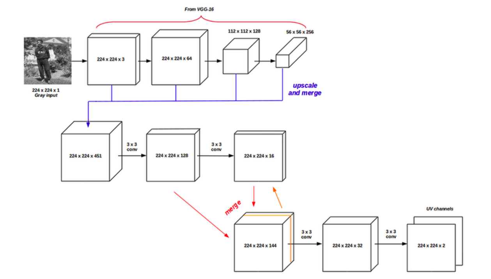

# Convolutional Neural Networks for automatic image colorization

The paper can be found [here](https://pdfs.semanticscholar.org/5a71/e3ada938c6c45a87988670118291b3028df6.pdf).

Other resources: [Automatic Colorization](https://tinyclouds.org/colorize/)

## Abstract

- Fully automatic image colorization
- Feed-forward, two-stage architecture based on CNN that predicts U and V colour channels
- SUN database for images
- Quaternion Structural Similarity (QSSIM)  for quantitative evaluation

We formulate image colorization as a **regression** problem and CNNs are used to solve the problem.

## Model Architecture



Similarly to Larsson et al. paper, semantic information and localization are important to this problem. Hence, this paper also uses VGG-16 since it is a pretrained model incorporates huge amounts of semantic information as it was trained on a dataset with >1 million images.

**Input:** 224x224 RGB. Our image is grayscale though, so we need to concatenate the image one after the other 3 times.

**Layers in VGG-16 that were used**: 

- All layers before the 3rd max pooling layer.

- These layers were merged and upscales to the same size as the input: 224x224x451 matrix denoted with $$T$$. Shown in the figure above, $$T$$ is then converted into UV channels.
  - Two more convolutional layers are output from the merged VGG-16 layers (no max pooling layers since we want the output image to have the same size as the input image)
  - These two layers are concatenated, now we have a new 224x224x144 matrix called $$Q$$.

**The CNN that we're actually training**:

**Input**: Matrix $$T$$

**Target**: $$UV_i$$ (predicted UV values)

**Optimizer**:  Stochastic Gradient 

- learning rate of 8×10−2 
- weight decay of 8×10−7 
- step decay of 0.5 for every 300 epochs.

**Loss Function**: Since Euclidean loss was too saturated they used **cross-entropy**

$$L(UV_p, UV) =  \frac{-1}{WH}\Sigma\space UV\space log(UV_p)$$

- $$W$$ is width of input image
- $$H$$ is height of input image

**Training Dataset**: ILSVRC 2012 classification dataset

- 500.000 images selected randomly from database then converted the training color images into greyscale images
- For each image, the U and V channels were calculated

**Calculating UV**:

```bash
Y = R *  .299000 + G *  .587000 + B *  .114000
U = R * -.168736 + G * -.331264 + B *  .500000 + 128
V = R *  .500000 + G * -.418688 + B * -.081312 + 128
```

## 


