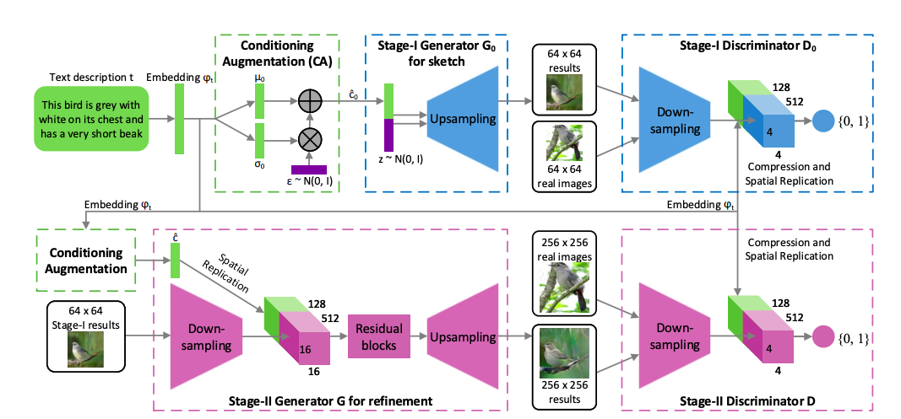

# StackGAN: Text to Photo-realistic Image Synthesis with Stacked Generative Adversarial Networks (Zhang et al., 2017)

This paper's model architecture has many components, so I thought it would be good to layout the specifics of the architecture before implementing it.

## Model Architecture

1. Stage-I GAN
2. Stage-2 GAN

## Stage-I GAN

**Input**: Text embedding of the text description $$(\varphi_t)$$

 ### Conditioning Augmentation (CA)

**Purpose**: Create $$\hat{c_0}$$ vector that captures the meaning of $$\varphi_t$$ with variations.

**Process**: $$\varphi_t$$ &rarr; FC layer &rarr; $$\mu_0, \sigma_0$$ &rarr; $$\mathcal{N}(\mu_0(\varphi_t),\sigma_0(\varphi_t))$$ &rarr; $$\hat{c_0}$$ sampled from this Gaussian distribution

**Output**: 

