# Attention Is All You Need

The **Transformer** replaces recurrence with self-attention, letting every token exchange context with every other token in parallel.

Source: Vaswani et al., 2017, `arXiv:1706.03762`.

## Roadmap
- Why the Transformer matters — **a brief history**
- Crash course: **neural networks, inputs, outputs**
- Why language is hard — and how **RNNs** tried to handle it
- Where RNNs broke down — **sequential** + **forgetful**
- Then: **attention, self-attention**, and the architecture

## A short history
- **Pre-2017:** language models were RNN / LSTM / GRU based — slow and forgetful
- **June 2017:** Google Brain + UofT publish "Attention Is All You Need"
- Replaces recurrence entirely with **self-attention** — fully parallel
- **Today:** every major LLM is a Transformer — GPT, Claude, Llama, Gemini, BERT, T5…

## What is a neural network?
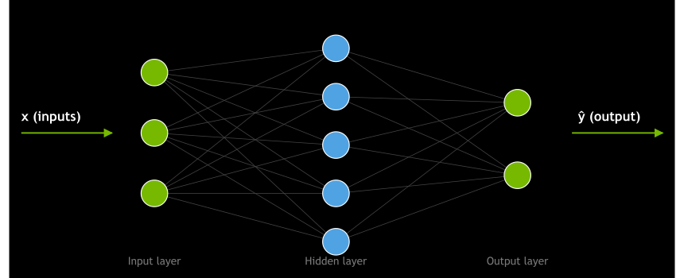

|  | predicted | true | error |
| --- | --- | --- | --- |
| y_1 | 0.72 | 1.00 | 0.28 |
| y_2 | 0.13 | 0.00 | 0.13 |

Each circle is a "neuron". Each line carries a learned weight. Stack layers → learn complex patterns.

## What about language?
**From numbers → tokens → sequences**

- Networks only speak **numbers** — text becomes `tokens` → `embedding vectors` first
- But a sentence isn't a single input — it's a **sequence**: order matters, length varies
- **"dog bites man"** ≠ **"man bites dog"** — same words, very different meaning
- Long-range dependencies: **"The keys, which were on the table, are missing."**
- We need something that processes **one token at a time** and remembers what came before — enter the **RNN**

## Enter the RNN
**Read tokens one at a time, carry a "hidden state" forward**

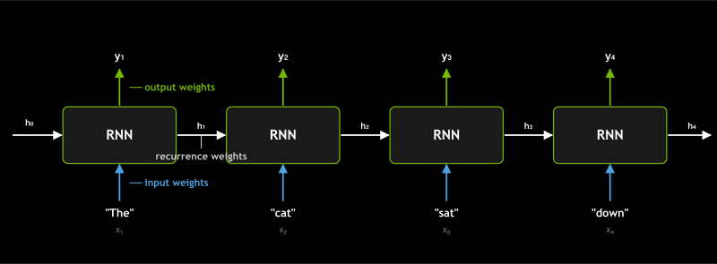

|  | predicted | true | error |
| --- | --- | --- | --- |
| y_1 | 0.62 | 1.00 | 0.38 |
| y_2 | 0.51 | 1.00 | 0.49 |
| y_3 | 0.74 | 1.00 | 0.26 |
| y_4 | 0.83 | 1.00 | 0.17 |

```text
h_t = tanh(W_x · x_t + W_h · h_{t-1})
y_t = W_y · h_t
```

## Where RNNs break down
**Two problems that motivated the Transformer**

### 1. Sequential — slow
Each step needs the previous step's hidden state, so the GPU sits idle waiting. You **can't parallelize across the sequence**.

### 2. Forgetful — vanishing gradients
Information from early tokens has to survive being multiplied through many timesteps. In practice it gets washed out — the model "forgets" the start of long sequences. LSTMs / GRUs help, but don't fix it.

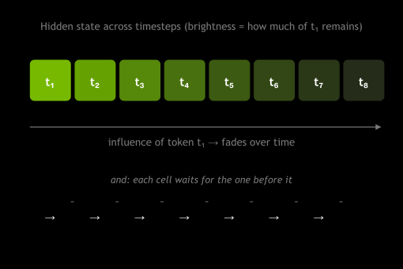

## The attention idea
> What if every token could see every other token in one step?

## Trace one example
**Translating "I am AI" to French — the model predicts one word at a time**

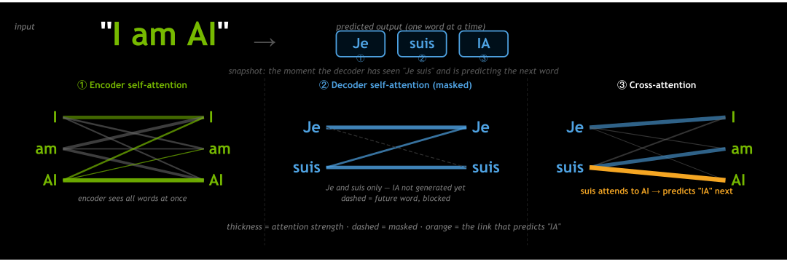

Attention is applied three times — each building on the last to arrive at the French word prediction.

## Full Transformer orientation
**The full Transformer — we're zooming into self-attention**


- **Encoder** (left) + **Decoder** (right)
- Bottom → **embeddings** + positional encoding
- Middle → **attention** + feed-forward, stacked N times
- Top → **linear** + softmax → next token probabilities

## The encoder at a high level
**Example: encoding "I am AI" for translation**

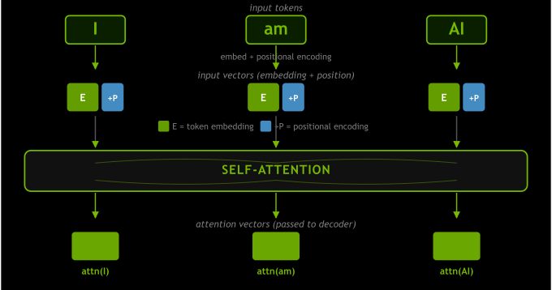

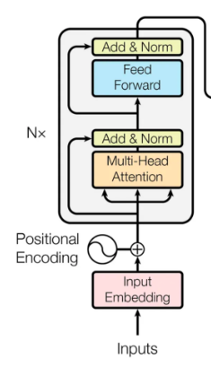

## The decoder at a high level
**Example: predicting the French translation word by word**

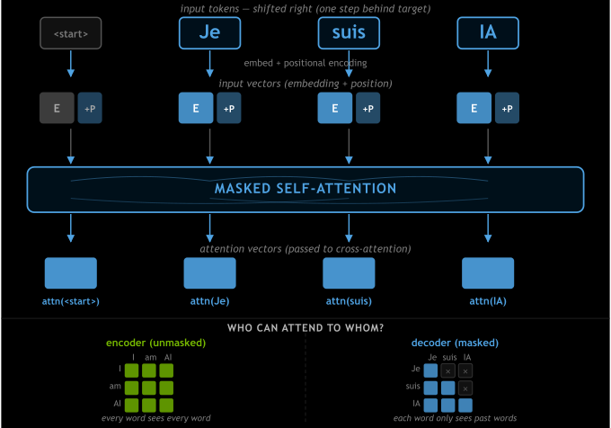

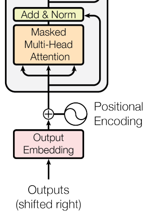

## Encoder-decoder cross-attention
**How the decoder reads the English sentence to predict the next word**

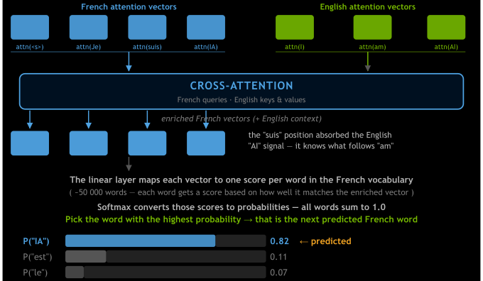

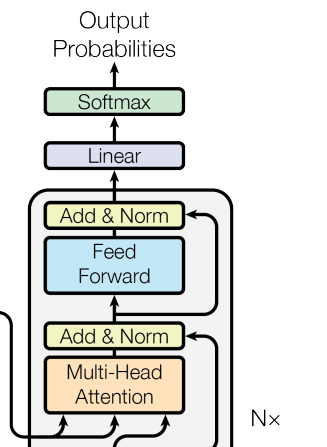

## Tokenize
**Cut the sentence into pieces the model can look up**

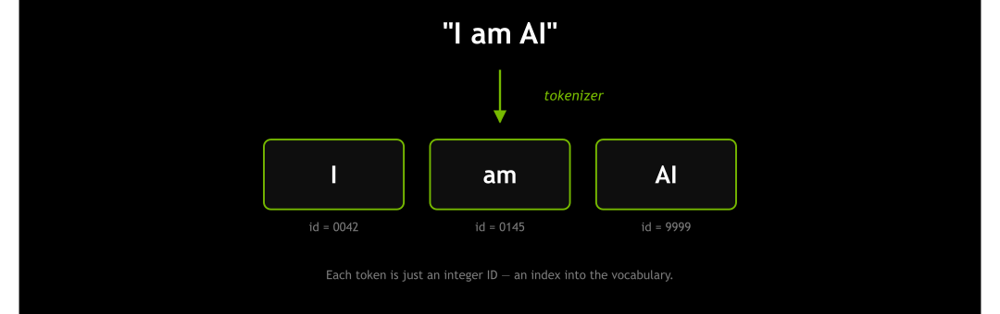

Real tokenizers (BPE / WordPiece) might split "AI" into subwords like "A" + "I". Conceptually identical.

## Embed
**Each token ID becomes a learned vector**

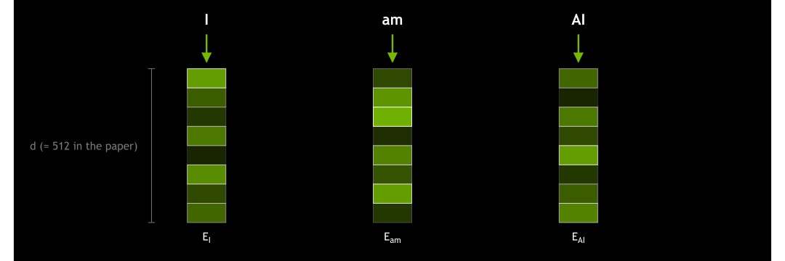

Embeddings are **learned** — similar tokens end up with similar vectors.

## Add positional encoding
**Embeddings have no built-in sense of order — so we add a vector that encodes each token's position**

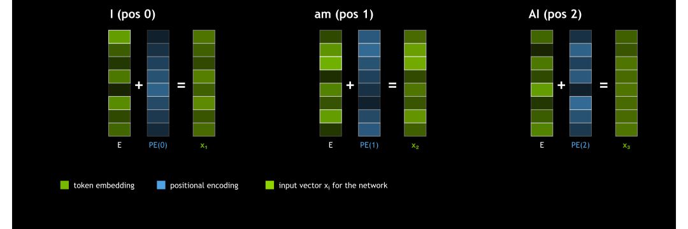

Original paper: **sin/cos** encoding. Modern variants: RoPE, ALiBi.

## Project to Q, K, V
**Multiply x by three learned matrices — each gives a different "view" of the token**

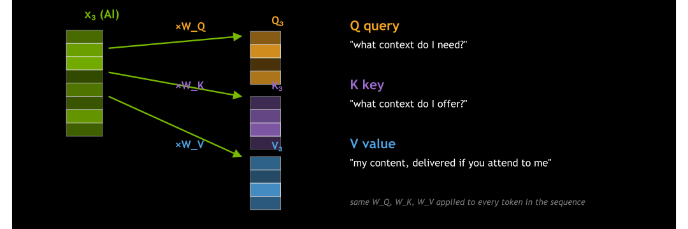

**W_Q, W_K, W_V** are learned — training shapes what "query", "key", and "value" mean for this model.

## Score Q·K
**AI's query asks every key: "how relevant are you to me?"**

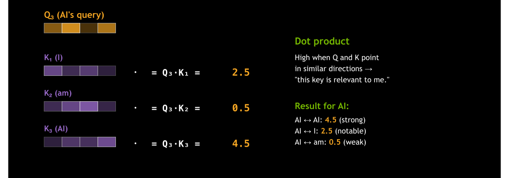

Three raw **scores** — but they're not weights yet. We need to normalize.

## Softmax to weights
**Turn raw scores into proportions that sum to 1**

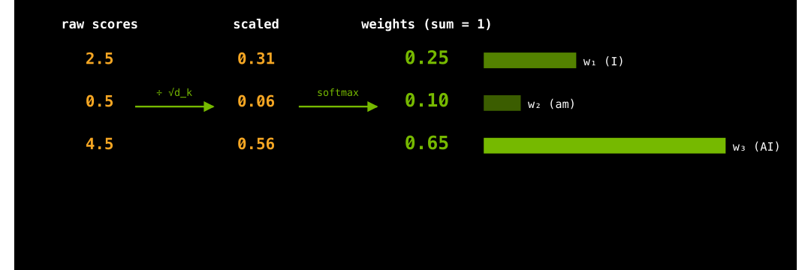

## Weighted sum of values
**AI's output = a learned mix of every token's content**

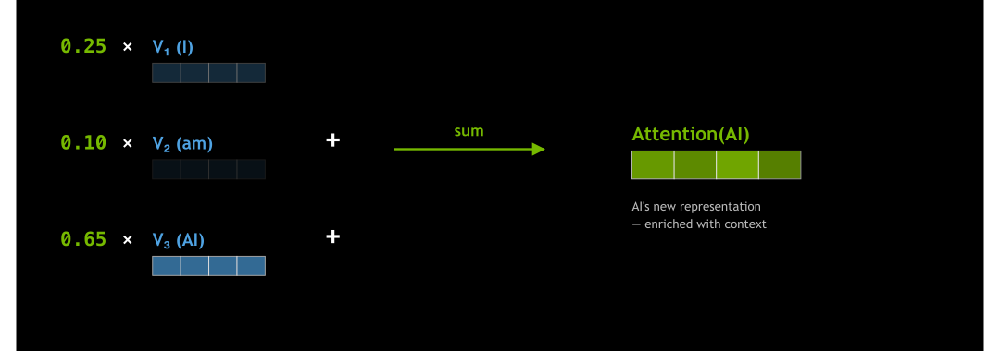

Same recipe applied to every token in parallel → every token gets a context-aware vector.

## All at once
**Stack all the queries, keys, and values — one matrix product does it for every token**

$$
\operatorname{Attention}(Q,K,V) = \operatorname{softmax}\left(\frac{QK^{\top}}{\sqrt{d_k}}\right)V
$$

- **Q, K, V** — each row is one token's query / key / value
- **QK^T** — gives an `n × n` score matrix: every token vs. every token
- **sqrt(d_k)** — scale to keep softmax well-behaved
- **softmax(...)V** — turn scores into weights, then mix the values

## All tokens in parallel
**The full attention computation — and what the output feeds into next**

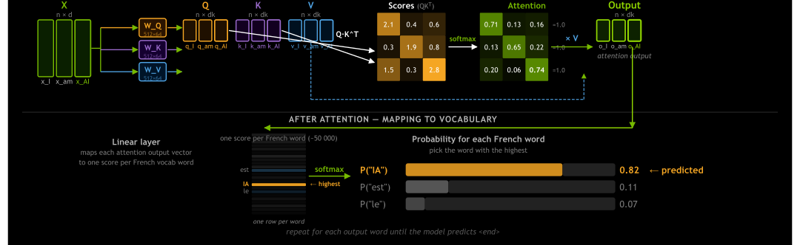

## TL;DR
- RNNs process tokens sequentially, which limits parallelism and makes long-range memory fragile.
- Self-attention lets each token compare its query to every token key, normalize those scores, and mix the value vectors.
- In matrix form, the whole sequence can be processed at once with `softmax(QK^T / sqrt(d_k))V`.
- The Transformer stacks attention with feed-forward layers, then maps contextual vectors to vocabulary probabilities.

## Related
- `Machine_Learning/LLMs/reading-llm-papers.md` — useful context for paper walkthroughs
- `Machine_Learning/Neural_Networks/neural-networks.md` — background on weights, layers, and activations
- `Machine_Learning/Recurrent_Neural_Networks/recurrent-neural-networks.md` — the sequence model the Transformer replaced
- `GPU_Concepts/tensors.md` — tensors are the arrays moved through the attention computation
