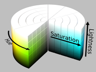

# Learning Representations for Automatic Colorization

Refer to the paper [here](https://arxiv.org/pdf/1603.06668.pdf). The slideshow can be found [here](https://on-demand.gputechconf.com/siggraph/2016/presentation/sig1639-gustav-larsson-learning-representations-for-automatic-colorization.pdf).

## Prerequisite Knowledge

**Colorization**: The inverse of desaturation (grayscaling).

## Abstract

- Train model to predict **per-pixel color histograms**
  - Used to automatically generate a coloured image

## Introduction

This paper combines ideas from image classification and object detection.

### Problems in past works that this paper tries to solve

1. Colourization usually requires some user input (not fully automatic)
2. Promising results on landscapes, but has trouble with complex images with foreground objects.
3. Requires processing of a large dataset (past approach is to find reference image and transfer colour onto a grayscale image)

### Technical System/Model Overview

**Design principles:**

- Semantic knowledge → Leverage ImageNet-based classifier 
-  Low-level/high-level features → Zoom-out/Hypercolumn architecture
- Colorization not unique → Predict histograms

1. Process **grayscale** image through VGG and take spatially localized multilayer slices **(hypercolumn)** as per-pixel descriptors
2. Train system to predict hue and chroma distributions for each pixel $$p$$ given its hypercolumn descriptor. These predicted distributions determine colour assignment.

### Going from histogram prediction to RGB image

- Sample
- Mode 
- Median ← Chroma
- Expectation ← Hue

### The Paper's Approach

1. **Semantic composition and localize objects** are important.
   - What is in the image, and where things are in the image
   - Use CNNs to achieve these things
2. Some image elements can be assigned **one** colour with high confidence (e.g. clothes, car), others could be **multiple** colours. To solve this, we predict a **colour histogram** instead of a single colour at every pixel.

## Related Work

Previous colorization methods fall into the following 3 categories.

### Scribble-based Methods

This method **required manually specifying desired colours in regions** of the image. Then, it would be assumed that **pixels adjacent to these regions would have similar colours** and brightness. The user can also further refine with additional scribbles.

### Transfer-based Methods

This method relies on the **availability of references images** as it transfer colour to grayscale images. This makes it partially manual.

### Automatic Direct Prediction Methods (What this paper is aiming for)

More in **Method**.

## Method

We have a learning function for this colorization problem: $$f(x)=y$$

- $$x$$ is a $$S*S$$ image patch - the receptive field/filter
- $$y$$ the colour of the center pixel
- $$f$$ 's neural network implementation is in the **System Overview** diagram above
  - **Last layer is always softmax for histogram predictions**

This task can be viewed as an image-to-image prediction problem. A **value is predicted for each input pixel**. These classification problems are usually done with pretrained networks. These networks can be converted to *fully-convolutional* layers which means the output image shape is the same as the input image shape using the *shift-and-stitch* method or the *a trous* algorithm.

### Skip-layer Connections

These connections link low- and mid-level features to the prediction/classifier layers. This paper implements this by extracting per-pixel descriptors by reading localized slices of multiple layers via hypercolumns.

### How do we generate training data (3.1 Colour Spaces)?

Converting colour images to grayscale according to $$L = \frac{R+G+B}{3}$$, $$L$$ is lightness is apparently overdetermined. So we try another approach while still considering $$L$$ in separate pass-through channels (in other words, we consider $$L$$ indirectly).

#### Hue/Chroma

**Problem with HSL** (1st image): The values of S and H are unstable at the top (white) and bottom (black). 

**Problems with HSV** (2nd image): Only unstable at the bottom (black), but then we lose $$L$$ as a channel.

**What's the solution to avoid instabilities AND keep $$L$$ as a channel?**

The 3rd image is our solution. It replaces saturation with chroma and we can convert value to lightness to indirectly have $$L$$ as a channel. $$V = L+\frac{C}{2}, S=\frac{C}{V}$$

#### Lab and $$\alpha \beta$$

$$Lab = L*a*b$$

- $$L$$ is lightness 
- $$(a, b)$$ ia a colour vector
  - Euclidean distance between this vector and the origin determins **chroma**.

Deshpande et al. use a color space similar to Lab, denoted “ab”. To differentiate from our "ab", we call their color space $$\alpha\beta$$.

**Summary of Colour-Space**: We can calculate $$V$$ and $$S$$ now. 

$$V=L+\frac{C}{2}=\frac{R+G+B}{3}+\frac{\sqrt{(a_2-a_2)^2-(b_2-b_1)^2}}{2}, S=\frac{\sqrt{(a_2-a_2)^2-(b_2-b_1)^2}}{V}$$

### 3.2 Loss

### Histogram Loss

At first, a mean squared error loss function was considered for measuring prediction errors. However, regression targets do not handle multimodal color distributions well. Instead, we predict distributions over a set of colour bins:

$$L_{hist}(x, y)=D_{KL}(y||f(x))$$

- $$y=[0,1]^K$$ represents the ground-truth histogram over $$K$$ bins.
  - Empirical distribution in a rectangular region of size $$R$$ around center pixel
  - set $$R=1$$, making $$y$$ and **one-hot** vector
  - $$K=32$$ for marginal distributions, $$K=16 * 16$$ for joint distributions.
  - $$x$$ is a $$S*S$$ image patch - the receptive field/filter
- $$D_{KL}$$ is the KL-divergence

### Binning Colour-Space

We bin the Lab axes by evenly spaced *Gaussian* quantiles ($$\mu=0, \sigma=25 $$).

### Hue/Chroma Loss

For this loss, we only consider marginal distributions and bin axes in $$[0,1]$$. Hue becomes unstable as chroma &rarr; 0. Adding a sample weight to hue based on chroma mitigates this.

$$L_{hue/chroma}(x, y)=D_{KL}(y_C||f_C(x)) + \lambda_{Hy_C}D_{KL}(y_H||f_H(x)) $$

- $$y=[0,1]^{2*K}$$
- $$y_C \in [0,1]$$, represents the sample pixel's chroma
- Set $$\lambda_H=5$$
- $$x$$ is a $$S*S$$ image patch - the receptive field/filter

### 3.3 Inference

Evaluate the network $$f$$ at every pixel $$n$$ in a test image: $$\hat{y}_n=f(x_n)$$. For the $$L_2$$ loss, we just have to combine this calculated $$\hat{y}_n$$ with the lightness and convert it to RGB.

With **histogram predictions**, we have the following options:

- **Sample**: Draw sample from histogram. If you are drawing per pixel, this may create high-frequency colour changes in areas of high-entropy histograms.
- **Mode**: Take the arg max $$\hat{y}_{n, k}$$  as the colour. Can create too extreme jarring transitions between colours.
- **Median**: Cumulative sum of $$\hat{y}_n$$ and use linear interpolation (line of best fit) to find the middle bin. However, this is undefined for circular histograms such as hue.
- **Expectation/Mean**: Sum over colour bin centroids weighted by histogram.

For **Lab** output, **expectations** produces the best results. For hue/chroma, **median** produces the best results.

Many objects appear without chroma, so $$C=0$$ often times. The mode draws the expectation closer to 0, so less saturated images are produced.

For hue, we compute the complex expectation:

To apply chromatic fading, define the predicted chroma by multiplying it by $$max(η−1|z|, 1)$$ where $$η=0.03$$.

### 3.5 Neural Network Architecture

Base network: **VGG-16**

Two changes to the network:

1. Classification layer (fc8) is discarded

