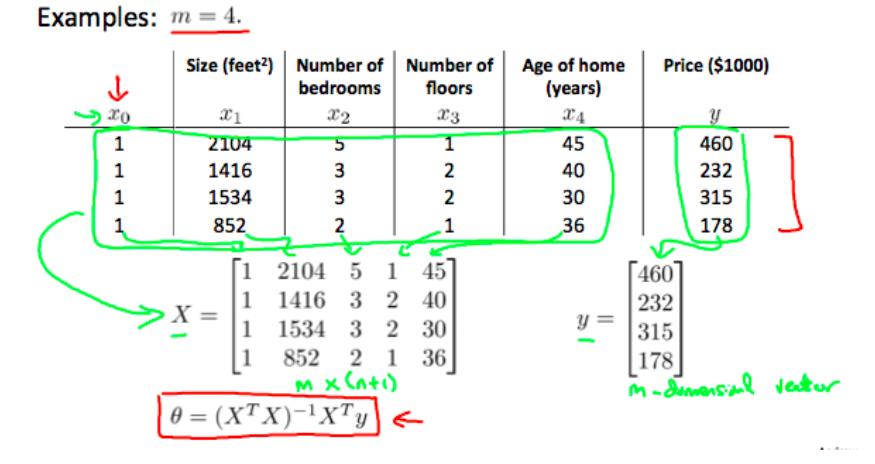

# Computing Parameters Analytically

## Normal Equation

You've seen gradient descent and how it is used to find the most optimal parameters to produce the lowest cost function. Using a normal equation is another method to find the most optimal parameters to minimize $$J(\theta)$$

### Finding Single Parameter:

If the cost function, $$J(\theta)$$ has a single parameter, we could just set $$\frac{d}{d\theta}J(\theta)=0$$ and solve for $$\theta$$. Done!

### Finding Two Parameters:

If the cost function, $$J(\theta_0, \theta_1)$$ has 2 parameters, we could just set $$\frac{d}{d\theta_0}J(\theta_0)=0$$ and  $$\frac{d}{d\theta_1}J(\theta_1)=0$$ and solve for $$\theta_0$$ and $$\theta_1$$. Done!

### Finding Many Parameters:

Now image using the above two methods for a cost function with MANY parameters. Essentially what if $$\theta\in\R^{n+1}$$ and $$n$$ represents the # of features and is VERY large. It would take a long time right?

So here's an equation that solves for $$\theta$$ altogether:

## $$\theta=(X^TX)^{-1}X^Ty$$

### Example of using Normal Equation

**Note**: Unlike gradient descent, feature scaling is not needed when using the normal equation.

### Gradient Descent vs. Normal Equation

So if using the normal equation is so simple? Why do we need gradient descent? Here are the pros and cons of each:

| Gradient Descent             | Normal Equation                                        |
| ---------------------------- | ------------------------------------------------------ |
| Need to choose alpha         | No need to choose alpha                                |
| Needs many iterations        | No need to iterate                                     |
| $$O(kn^2)$$                  | $$O(n^3)$$ since calculating $$(X^TX)^{-1}$$ is costly |
| Works well if $$n$$ is large | Slow if $$n$$ is large                                 |

**General Rule of Thumb**: If $$n\gt10000$$, then use gradient descent instead of normal equation. Also, even though the normal equation works with linear regression, some algorithms don't work with it, so we would have to use gradient descent anyway.

### What if $$X^TX$$is not invertible?

- Redundant features ($$X$$ might be linearly dependent), so just take those features out
- Too many features ($$n\ge m$$), so delete some features or use regularization