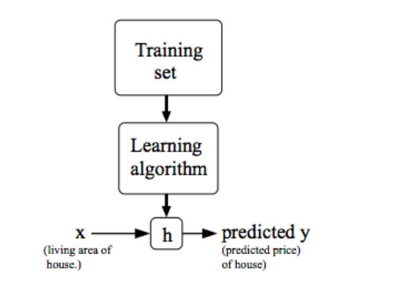
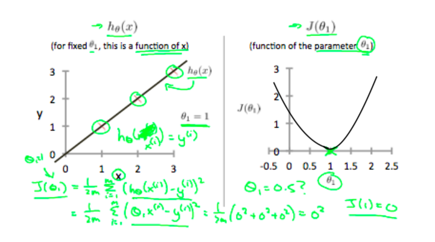
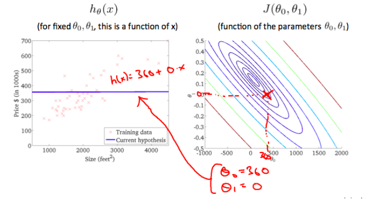
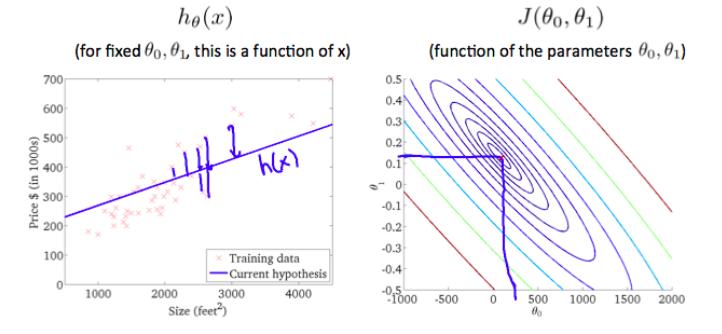

# Model and Cost Function

## Formal Supervised Learning Model Representation

**Goal**: To make the hypothesis/prediction, $$h$$,  a good predictor when $$x$$ is the input and $$y$$ is the output. We essentially want $$h(x)=y$$ (Want the prediction to equal the answer/output)

- When $$y$$ is continuous &rarr; Regression problem
- When $$y$$ is discrete &rarr; Classification problem

## Cost Function for Linear Regression

**Hypothesis**: $$h_\theta(x) = \theta_0+\theta_1x$$ 

- $$\theta_i$$ are called parameters

Q: How do we choose these parameters to make $$h$$ close/equal to $$y$$? 

A: Minimization problem! We want to minimize this: $$h(x_i)-y_i$$. If this difference is 0, then the two values are equal, thus a perfect prediction. So we have to find the $$\theta_i$$ values that minimize this expression. We can expand this idea to a quadratic function called a mean squared error function, a type of cost function: 

#### Mean Squared Error Function: $$J(\theta_0, \theta_1) = \frac{1}{2m}\Sigma(h_\theta(x_i)-y_i)^2$$ 

- $$J(\theta_0, \theta_1)$$ is the cost function. We want to minimize this function's output. Remember these parameters are represented in the hypothesis equation above.
- Common cost function for **linear regression** problems

**Note**: $$\frac{1}{2}$$ just makes the math for gradient descent easier for the moment and $$m$$ represents # of training samples.

**Example**:

- On the left, we have the hypothesis graphed. We can see that when $$\theta_1=1$$, the line fits the training data perfectly.
- On the right, we have that the cost function, $$J(\theta_1)=0$$ when $$\theta_1=1$$
  - **Note**: We have made $$\theta_0=0$$ for simplicity's sake, if we were to graph $$J(\theta_0, \theta_1)$$ we would have a multivariable graph and thus - a 3D graph (yay for Math 237)
  - The cost function is formed from graphing the mean squared error function from above which depends on the hypothesis (equation above).
  - **Conclusion**: we can see that the value of $$\theta_1$$ that minimizes the cost function is the same value of the slope of the line that is the closest the training data. Our goal of fitting closely to the training data has been achieved!

## Multivariable Cost Function for Linear Regression

The cost function this time is represented using two variables and plotted using contour plots (remember in Math 237, the contours are kind of coming out of the page to create a 3D shape).

You can see that as you get closer to the minimum, similarly in 2D, $$h$$ becomes a better predictor. In other words, its line of best fit is closer to the training data. Yay! 